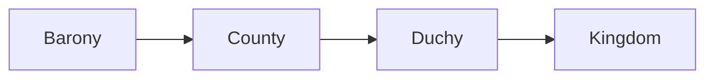

# Choosing Your Start

> *Game as of **30 June 2026** (beta) - details may change.*

New games now begin with a **start selector**. You are not locked to one fixed Asturias run: you choose a rank, browse playable titles, then take control of the historical house that holds the title.

## The four starting ranks

| Rank | What it means | Difficulty |
|---|---|---|
| **Kingdom** | You control a crown or emirate with the best opening resources. | Recommended |
| **Duchy** | You control a regional title and some land below a king. | Medium |
| **County** | You control one province under a higher lord. | Hard |
| **Barony** | You hold a small secular holding inside someone else's county. | Hardest |

Lower ranks start with less gold, fewer troops, weaker Power bars and a real **ascent goal**. A baron first wants a county; a count wants a duchy; a duke wants a kingdom.

## Faith filters

After choosing a rank, the selector lets you filter titles by **Christian** or **Islamic** starts. Tapping the active filter again clears it and shows both.

Faith matters immediately:

- Christian rulers answer to Rome and can use [[The Papacy]].
- Islamic male rulers may have up to four living spouses and use Umma-flavoured religious systems.
- Muslim and Jewish rulers are not subject to papal excommunication.
- The first Power bar changes label and meaning by faith: Church, Umma or Aljama.

## What counts as playable

The selector only offers titles that can actually start a campaign:

- The title must have a valid landed, non-clergy holder.
- Temple holdings are excluded.
- If a holder already has a higher title, only that highest title appears. You do not see the same ruler repeated as king, duke and count.
- Kingdom starts must still have territory on the map.
- Barony starts must be secular holdings, not temple baronies.

When you confirm, the chosen historical house keeps its identity: name, members, culture, shield and titles. The game simply marks that house as **your** bloodline and moves the player focus to it.

## The recommended start

The kingdom of Asturias is marked as the most direct start because it gives you a crown, more troops, more gold and no need to climb to a higher rank. It is still not the only intended way to play. A county, duchy, barony or Andalusi start is a valid alternate history.

## Special note: al-Andalus

Unified al-Andalus is stable early but not forever. In **929**, if it still exists, it becomes the Caliphate of Qurtuba. In **1031**, it can fracture into taifas. If you began as an Andalusi ruler and held the unified realm, your house keeps one playable taifa when the break happens while the rest passes to local powers.

Later, from **1086** and again from **1147**, outside Muslim powers can reabsorb weak taifas unless they are protected or no longer Muslim-held. Alliances can matter as much as conquest.

## Good first choices

- New players: choose **Kingdom**, preferably the recommended start.
- CK-style challenge: choose **Duchy** or **County** and climb.
- Punishing run: choose **Barony** and focus on survival, claims and title plots.
- Alternate-history run: choose an **Islamic** start and plan around taifas, Umma and different marriage rules.

---

*Next: [[The Four Powers]] - Related: [[Climbing the Ladder]], [[Faith and Religion]], [[The Map of Hispania]].*
