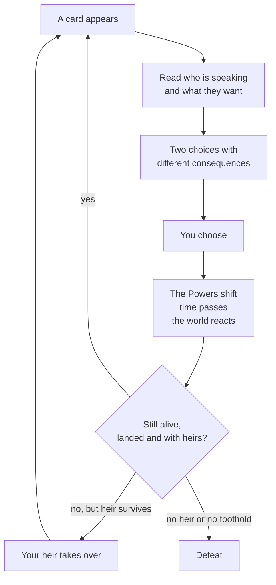

# How to Play

> *Game as of **30 June 2026** (beta) - details may change.*

If you have never played, read this page first. Everything else in the guide expands on it.

## The core idea

You are the head of a **playable house**. Depending on your start you may be a king, emir, duke, count, wali, baron or another local ruler, but the loop is the same: someone in your realm brings you a situation as a **card**, and you choose one of two responses by swiping or tapping.

Most ordinary cards advance the calendar by **one season**. Quick reaction cards from actions such as schemes, alliances or marriages resolve immediately without burning a full season.

## First: choose your start

After the intro, you choose a starting **rank**, **faith group** and **title**. The recommended start is a kingdom, but duchies, counties and baronies are playable and intentionally harder. See [[Choosing Your Start]] before starting a difficult lower-rank run.

## The four things you are balancing

Every decision nudges four **Powers**: faith authority, the People, the Army and the Treasury. The first one appears as **Church**, **Umma** or **Aljama** depending on your ruler's faith. Keep all four healthy. Let one collapse to nothing, or let the Church/Umma or Army become too dominant, and your reign can end in disaster. See [[The Four Powers]].

## Your ruler will die

Rulers age, fight, fall ill and get caught in disasters. Death is not automatically game over: your **heir** inherits if one exists and your house remains landed. The real danger is losing the bloodline, losing every holding, or being overthrown with no successor. See [[Your Dynasty and Heirs]].

## There is more than cards

Between decisions you can open menus to actively **govern**:

- The **map** - manage land, build in your holdings and wage [[War]].
- The **court & council** - appoint officers and manage [[Noble Houses and Vassals|nobles]].
- The **economy** - build, borrow, repay and watch debt.
- **Faith** - convert provinces, adopt doctrines and, if Christian, deal with [[The Papacy]].
- Your **dynasty** - arrange marriages, name heirs and manage relatives.

Ignoring these systems for too long can trigger [[The Royal Court|court neglect]]. Swiping cards is not the same as ruling.

## Your first ten minutes

1. Pick a start that matches the challenge you want. Kingdom is safest; barony is hardest.
2. Read each card's speaker and request before choosing.
3. Watch the four Power bars. Rescue anything near empty and cool down Church/Umma or Army if they are too high.
4. Secure marriage and children early unless your house already has a wide line.
5. Open the map and council soon. Build, appoint or plan a claim so court neglect does not start quietly.

## Where to go next

- [[Choosing Your Start]] - understand the start selector.
- [[The Four Powers]] - the single most important survival page.
- [[Making Decisions]] - how choices, hints and pressure work.
- [[Strategy and Tips]] - survive your early reigns.

---

*Part of the [[index|Hispania Royal House Player's Guide]].*
