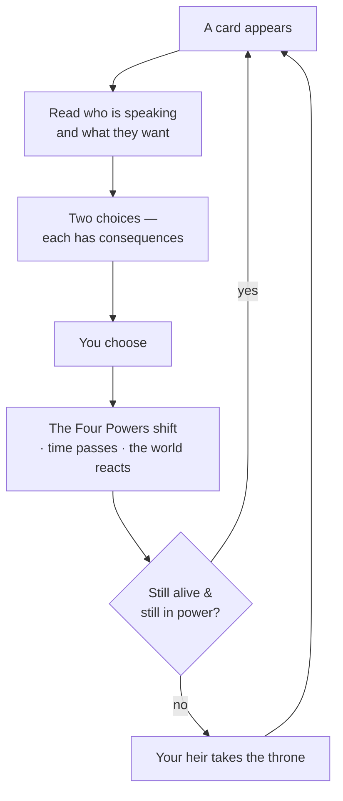

# 🃏 How to Play

> 📌 *Game as of **29 June 2026** (beta) — details may change.*

If you've never played, read this page first. Everything else in the guide expands on it.

## The core idea

You are a **monarch**. Each turn, someone in your realm comes to you with a situation — a bishop, a general, a scheming cousin, a hungry village — shown to you as a **card**. You make a decision by choosing one of two options (usually by **swiping** the card left or right, or tapping a choice).

That's the whole game loop. But each small decision quietly moves the things that keep you in power.

## The four things you're balancing

Every decision nudges four **Powers**: the **Church**, the **People**, the **Army**, and the **Treasury**. Keep all four healthy. Let any one collapse to nothing — or let the Church or Army become *too* powerful — and your reign can end in disaster. This is the heart of the game, explained in full in [[The Four Powers]].

## You will die — and that's fine

Monarchs age and die. When yours does, the game doesn't end: your **heir** takes the throne and you keep playing as them. The real failure is **running out of heirs** (your dynasty going extinct) or being **overthrown** with no one to inherit. Securing the next generation is your constant background job — see [[Your Dynasty and Heirs]].

## There's more than cards

Between decisions you can open menus to actively **rule**:
- 🗺️ The **map** — manage your lands, wage [[War]], and grow your realm.
- 🏛️ The **court & council** — appoint officers and manage your [[Noble Houses and Vassals|nobles]].
- 💰 The **economy** — buildings, gold and debt.
- ⛪ **Faith** — convert provinces, deal with the [[The Papacy|Pope]].
- 👨‍👩‍👧 Your **dynasty** — arrange marriages, name heirs, raise children.

You don't have to use all of these to survive, but ignoring your realm entirely has consequences (see [[The Royal Court|court neglect]]).

## Your first ten minutes — a checklist

1. ✅ Read each card's **speaker and request** before choosing — context matters.
2. ✅ Watch the **four Power bars**. If one is getting low, favour choices that lift it.
3. ✅ Get **married** and have a **child** early — an heir is your insurance ([[Marriage and Family]]).
4. ✅ Don't panic over small dips; panic when a bar is near **empty** or near **full**.
5. ✅ Peek at the **map** and **council** to see your realm, but you can learn those later.

## Where to go next

- ⚖️ [[The Four Powers]] — the single most important page.
- 🤔 [[Making Decisions]] — how choices, hints and long-term pressure work.
- 💡 [[Strategy and Tips]] — survive your early reigns.

---

*Part of the [[index|Hispania Royal House Player's Guide]].*
