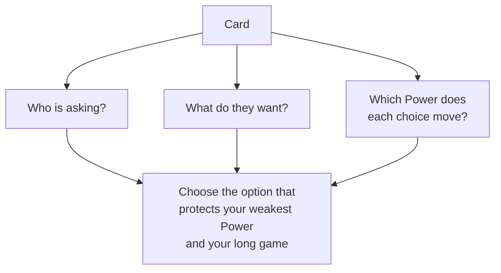

# 🤔 Making Decisions

> 📌 *Game as of **29 June 2026** (beta) — details may change.*

Every card is a small fork in the road. Understanding *how* choices work makes you a far better ruler.

## Reading a card

Each card shows you:
- **Who is speaking** (a bishop, a noble, a relative, a foreign envoy…).
- **The situation** they bring.
- **Two choices** — usually one on each side.

Before you decide, ask: *who benefits, who is angered, and which [[The Four Powers|Power]] does each choice move?*

## The advisor's hint

The game often shows a **gentle hint** for the current card — a passing note suggesting which way to lean and *why*, based on your realm's current state. It's **advice, not a command**: it never blocks you and you're free to ignore it. Use it as a second opinion, especially while learning.

## Immediate effects vs. hidden pressure

A choice has two kinds of consequences:
1. **Immediate** — the [[The Four Powers|Powers]] shift right away, gold changes hands, a child is born, a war begins, and so on.
2. **Hidden long-term pressure** — some choices quietly make your realm a little harder to hold over time, even if the bars barely move now. Rulers who repeatedly take the "easy" or extreme path accumulate this pressure and find later years tougher.

> [!tip] Think a reign ahead
> The bars tell you *now*; the hidden pressure shapes *later*. Consistent, moderate rule ages far better than lurching between extremes.

## Difficulty changes the stakes

On harder difficulty, **losses hit harder** and the game is less forgiving of crises. On easier settings, penalties are softened and your dynasty gets extra protection from extinction. See [[Difficulty]].

## Some actions are "quick reactions"

A few cards are **immediate reactions** to something *you* set in motion — arranging a marriage, launching a scheme, trying for an heir. These resolve on the spot **without** advancing the calendar or aging the world. That's deliberate: answering a flurry of your own follow-ups shouldn't burn years off your reign. The game also limits how many such reactions can pile up at once, so you can't flood yourself.

## Decisions you make in menus

Not all choices come as cards. When you open the [[The Map of Hispania|map]], the [[Your Council|council]], the [[Economy and Gold|economy]] or [[Diplomacy and Alliances|diplomacy]], you make **active** decisions there too. Genuinely governing through these menus also keeps your court content — see [[The Royal Court|court neglect]].

## Quick tips

- 🔍 Don't auto-swipe. The same-looking card can have different best answers depending on your bars.
- 🩹 When a Power is in danger, prioritise it over a tempting reward.
- 🧭 Read the hint, then decide for *your* situation.
- ⏳ Remember the long game — avoid stacking extreme choices.

---

*Next: [[Time and Your Lifespan]] · Related: [[The Four Powers]], [[Strategy and Tips]].*
