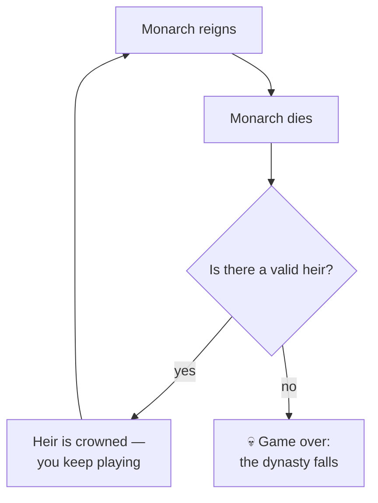

# ⏳ Time and Your Lifespan

> 📌 *Game as of **29 June 2026** (beta) — details may change.*

The game runs across a vast stretch of history — **722 to 1492** — but you experience it one decision at a time.

## A turn is a season

Each ordinary card advances the calendar by about a **season** (three months). Four seasons make a year. So a long, careful reign can span decades of game-time, while the world ages around you: people grow up, marry, and pass away.

## Monarchs age and die

Your ruler gets older with the years. Death can come from:
- 🕰️ **Old age** — the most natural ending for a long, successful reign.
- 🤒 **Events** — plague, a battle wound, a fall, poison, a difficult childbirth, and so on, delivered by cards.
- 💥 **Collapse** — a [[The Four Powers|Power]] crisis, bankruptcy, or being overthrown.

You can sometimes ease the toll: a ruler who **rests** recovers a little and lowers their stress (see [[Traits and Your Character]]).

## One death, a new chapter

When your monarch dies, the game moves to a **reign-end** screen summarising their life, then your **heir** is crowned and you continue as them. The throne, the lands and the family history carry over — but each new monarch starts a fresh political balance, so an out-of-control Army or Church doesn't automatically doom the newcomer.

## The clock is also a goal

History has an ending. If you reach **1492**, the era closes — and what happens depends on whether you've fulfilled your destiny (most famously, taking **Granada**). The march of time is both your enemy and your scoreboard. See [[Winning and Losing]].

## Practical takeaways

- 👶 Secure an **heir early** — death can come at any time ([[Your Dynasty and Heirs]]).
- 🛌 Use **rest** when stress is high and the realm is calm.
- 🏰 Don't measure success by one monarch — measure it by the **dynasty** across centuries.

---

*Next: [[Your Dynasty and Heirs]] · Related: [[Winning and Losing]].*
