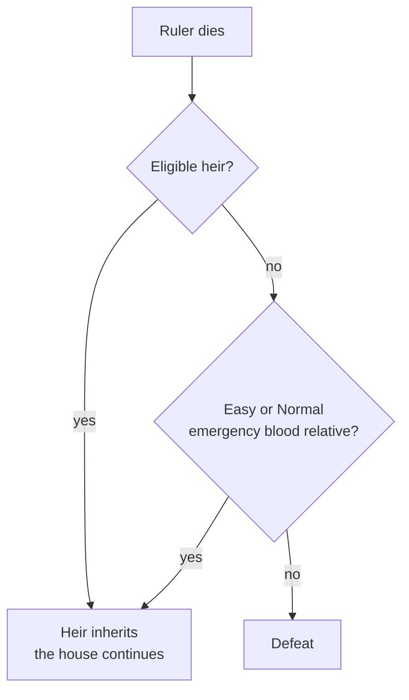

# Time and Your Lifespan

> *Game as of **30 June 2026** (beta) - details may change.*

The game runs from **722** to **1492**, but you experience it one decision at a time.

## Seasons, not single days

Most normal event cards advance time by **three months**. Four real card turns make a year:

Action follow-ups such as scheme reports, marriage arrangements and alliance reactions are quicker. They resolve consequences without necessarily spending a full season.

## Rulers age and die

Your current ruler ages with the calendar. Old age becomes dangerous, but death can also come from war, plague, poison, collapse, debt, crisis or event choices.

When a ruler dies, the game shows the death and reign-end sequence, then checks succession:

Each new ruler starts a new chapter. They inherit the house, lands and history, but they still have to manage their own court, finances and crises.

## The 1492 horizon

History closes in **1492**. If your house has already unified Hispania, victory can be recorded and you may be able to continue ruling the united realm until the date arrives. If 1492 arrives without victory, the campaign ends in defeat.

Granada remains a major scripted milestone and can still deliver the classic Reconquista ending, but the current sandbox victory is broader: one house controlling the whole peninsula. See [[Winning and Losing]].

## Tips

- Think in **seasons**. A few bad cards can burn years quickly.
- Secure heirs before your ruler becomes old or stressed.
- Use long reigns to build permanent advantages: [[Dynasty Legacy|legacies]], [[Culture and Innovations|innovations]] and [[Doctrines and Excommunication|doctrines]].
- Do not measure success by one ruler. Measure the house across centuries.

---

*Related: [[Your Dynasty and Heirs]], [[Winning and Losing]], [[Difficulty]].*
