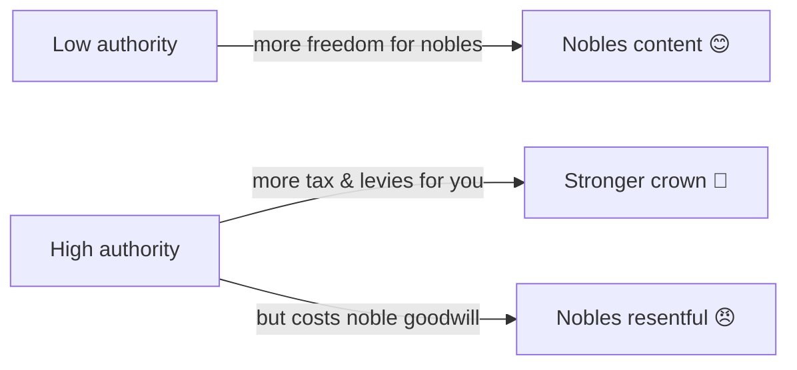

# ⚖️ Crown Authority and Tyranny

> 📌 *Game as of **29 June 2026** (beta) — details may change.*

How much power does the crown hold over its [[Noble Houses and Vassals|nobles]]? That's the tug-of-war between **authority** (what they owe you) and the **tyranny** you incur by overreaching.

## Crown authority

Authority sets how much **tax and troops** your vassals owe. You can raise or lower it.

- ⬆️ **Raise it** to wring out more income and manpower — but each step **costs the nobility's goodwill**, and pushing too fast breeds [[Noble Houses and Vassals|factions]].
- ⬇️ **Lower it** as a gift that wins loyalty back.
- You can't flip it back and forth instantly — changes have a cooldown.

## Tyranny — the cost of arbitrary rule

**Tyranny** builds up whenever you act *lawlessly* — imprisoning or harming a vassal without justification, or trampling on their rights. While tyranny is high:
- 😈 Conspiracies grow bolder.
- 💔 Every noble likes you a little less.
- ⛪ A Christian ruler risks the [[Doctrines and Excommunication|Pope's wrath]].

Tyranny fades slowly on its own, but the damage while it's high is real.

## The lawful way to be ruthless

There's a clean alternative to tyranny: hold **leverage** over a house first. With a **hook** (a secret or a debt) you can force a vassal to comply **without** incurring tyranny — coercion that looks legitimate. See [[Intrigue and Schemes]].

> [!tip] Three levers, three costs
> - **Authority** = the law (raises income, costs goodwill).
> - **Dread** = fear (deters revolt, but fades — see [[Traits and Your Character]]).
> - **Hooks** = leverage (force compliance with no tyranny).
> A skilled ruler uses all three rather than leaning on raw cruelty.

## Tips

- 🐢 Raise authority **gradually**, not in a rush.
- 🪝 Need to lean on a vassal? Get a **hook** first to avoid tyranny.
- 🧯 If tyranny is high, **back off** and let it decay before the factions and the Church move against you.

---

*Next: [[Intrigue and Schemes]] · Related: [[Noble Houses and Vassals]], [[Doctrines and Excommunication]].*
