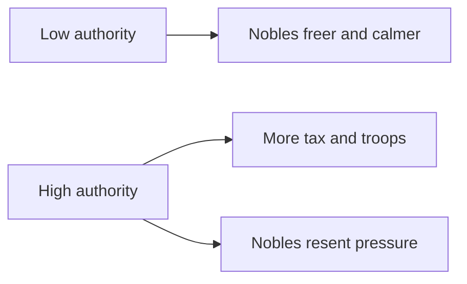

# Crown Authority and Tyranny

> Game as of **30 June 2026** (beta). Details may change.

Authority is how much formal power your title has over [[Noble Houses and Vassals|vassals]]. Tyranny is the cost of ruling lawlessly. Even when you are not literally a king, the same logic applies to your ruling house.

## Authority

Authority sets how much tax and military support vassals owe. Raising it strengthens your rule, but costs noble goodwill. Lowering it can calm the realm.

Authority changes have a cooldown, so you cannot freely toggle the realm between harsh and soft rule.

## Tyranny

Tyranny rises when you act without lawful justification: harming, imprisoning or trampling a vassal's rights without a good reason. While tyranny is high:

- Conspiracies grow bolder.
- Noble relations suffer.
- Christian rulers risk papal hostility if faith standing is also low.

Tyranny fades slowly, but the damage while it is high is real.

## Lawful ruthlessness

Hooks are the clean alternative. If you hold leverage over a house, you can force compliance without taking the same tyranny hit. See [[Intrigue and Schemes]].

> [!tip] Three levers, three costs
> **Authority** is law. **Dread** is fear. **Hooks** are leverage. A stable ruler uses all three instead of relying only on cruelty.

## Tips

- Raise authority gradually.
- Get a hook before leaning on a dangerous vassal.
- If tyranny is high, stop creating new grievances and let it decay.
- Christian rulers should avoid combining high tyranny with low Church standing.

---

*Next: [[Intrigue and Schemes]] - Related: [[Noble Houses and Vassals]], [[Doctrines and Excommunication]].*
