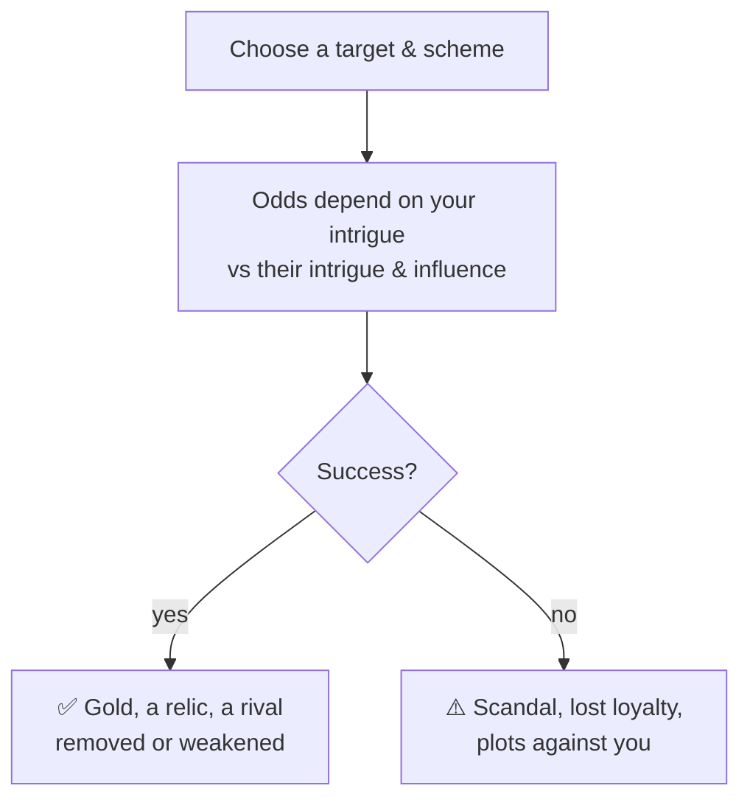

# 🗡️ Intrigue and Schemes

> 📌 *Game as of **29 June 2026** (beta) — details may change.*

Not every problem is solved in the open. Through your **spymaster** and your own cunning, you can work in the shadows — gathering leverage, plotting, and undermining rivals.

## Hooks — leverage over a house

A **hook** is something you hold over a noble — a discovered secret or an owed favour. With one, you can **force a house to comply** (gold, loyalty, troops) **without** the [[Crown Authority and Tyranny|tyranny]] that open bullying would cause.

| Hook | Strength | Use |
|---|---|---|
| 🪶 **Weak hook** | one-time | spent the moment you call it in |
| ⛓️ **Strong hook** | lasting | a hold you can lean on again and again |

Hooks come from your [[Your Council|spymaster]] uncovering secrets, or as favours earned through events. They're the *clean* way to be ruthless.

## Schemes against people

At court you can act against individuals — scheme, steal, kidnap, or worse — with risk and reward scaled by the **intrigue** and **influence** of the people involved. Bold plots can remove a rival or seize a [[Relics and Treasures|relic]], but failure brings scandal, lost loyalty and conspiracies against *you*.

## Seduction and relationships

Beyond formal [[Marriage and Family|marriage]], characters can pursue **seduction** — which can deepen bonds, create [[Bastards|recognised children]], or build influence. Like all intrigue, it carries risk.

## The long game: plotting for a title

Schemes against your own **liege** (the lord above you) are deliberately **long, risky paths** — not something that happens in a single card. A title plot builds **progress** over many turns while raising **suspicion**; push too hard and you're exposed. This is one way to [[Climbing the Ladder|climb the feudal ladder]] without open war.

> [!tip] Intrigue is patient
> Schemes reward planning, not impatience. Build leverage, pick your moment, and don't let suspicion outrun your progress.

## Tips

- 🪝 Prefer a **hook** over brute force — same result, no tyranny.
- 🕵️ Keep a capable **spymaster** to keep the hooks coming.
- ⏳ Treat title plots as a **marathon**; watch your suspicion.
- ⚠️ Have a reason ready if a scheme fails — fallout can be severe.

---

*Related: [[Crown Authority and Tyranny]], [[Your Council]], [[Climbing the Ladder]].*
