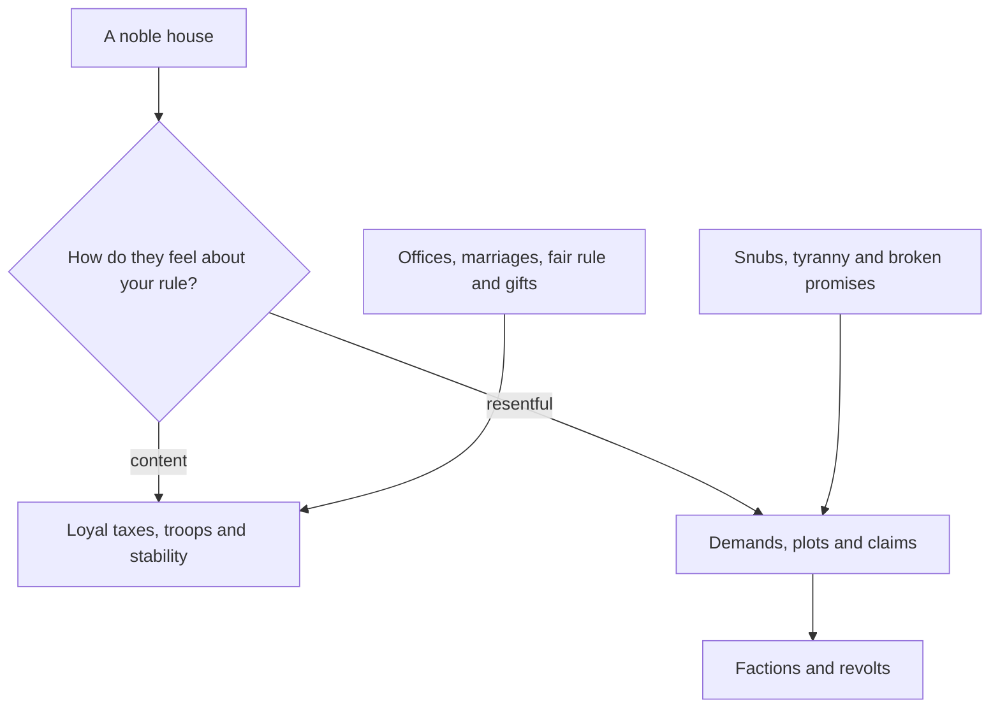

# Noble Houses and Vassals

> Game as of **30 June 2026** (beta). Details may change.

You do not rule alone. Hispania is full of noble houses, clergy and town powers that hold land, raise troops and judge your rule. Managing them is half of staying in power.

## What makes a house

Each house has:

- **Lands** it holds on [[The Map of Hispania|the map]].
- **Power** from military, economic and political weight.
- **Relationship** with your ruling house.
- **Claims** on titles when they believe they deserve them.

Houses run their own affairs in the background. They earn money, build holdings, gather troops and rise or decline over time.

## Keeping houses happy

Reward powerful houses with [[Your Council|offices]] and [[Marriage and Family|marriages]], rule fairly and they are more likely to stay loyal. Snub them, rule arbitrarily or let one house grow too strong and they can become a threat.

## Factions

Unhappy houses can band together into a **faction** with a shared grievance and a leader. Factions are how discontent becomes organized, and at the extreme they can trigger [[War|civil war]].

Address grievances early. It is cheaper to defuse a faction than to defeat it after swords are drawn.

## Vassals

The houses that formally answer to your title are your **vassals**. Higher authority means more tax and troops from them, but also more resentment. See [[Crown Authority and Tyranny]].

## Ways to handle a house

- Ally with it before a dangerous war.
- Appoint its head to office to buy goodwill.
- Marry into it to bind it to your bloodline.
- Gather hooks to force compliance without normal tyranny.
- Pressure or scheme against a rival, knowing resentment will follow.

## Tips

- Watch the most powerful houses first.
- Spread offices and marriages among families you cannot afford to alienate.
- Keep factions from maturing into civil war.

---

*Next: [[Crown Authority and Tyranny]] - Related: [[The Royal Court]], [[War]].*
