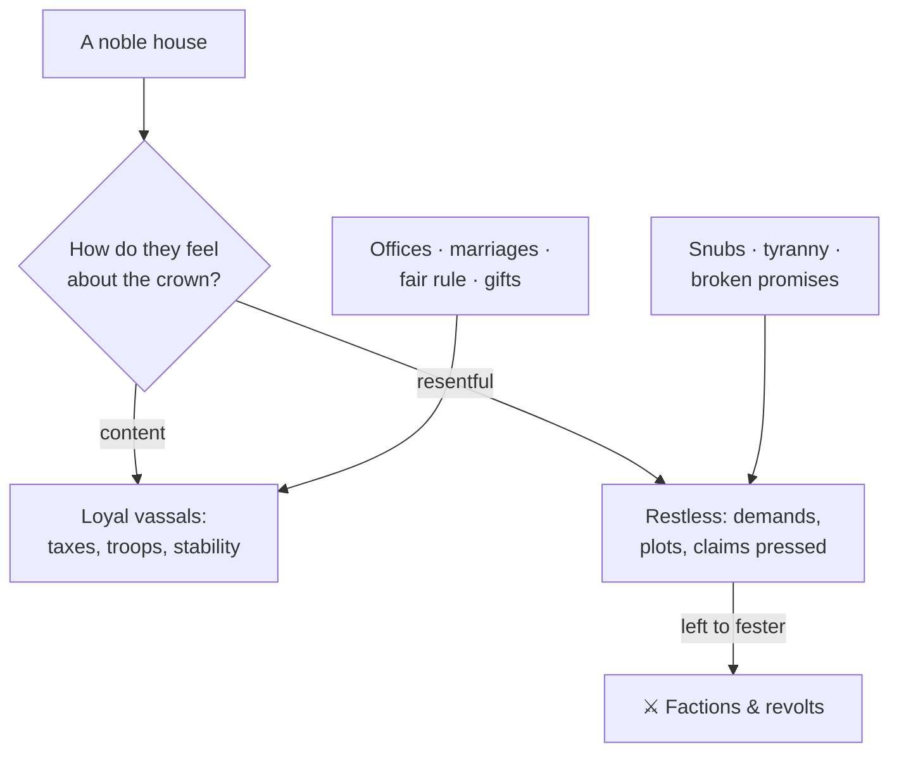

# 🛡️ Noble Houses and Vassals

> 📌 *Game as of **29 June 2026** (beta) — details may change.*

You don't rule alone. Hispania is full of **noble houses** — great families, clergy and town powers — who hold land, raise troops and have opinions about you. Managing them is half of staying in power.

## What makes a house

Each house has:
- 🗺️ **Lands** it holds on the [[The Map of Hispania|map]].
- 💪 **Power** — military, economic and political weight.
- ❤️ A **relationship** with the crown (how much they like or resent you).
- 👑 Sometimes a **claim** on your throne, if they think they deserve it.

Houses run their own affairs in the background — they earn money, invest, build up troops, and grow or decline in power over time.

## Keeping houses happy (or not)

Reward powerful houses with [[Your Council|offices]] and [[Marriage and Family|marriages]], rule fairly, and they stay loyal. Snub them, rule arbitrarily, or let one grow over-mighty, and they turn restless.

## Factions

When houses are unhappy, they can band together into a **faction** with a shared grievance and a leader. Factions are how discontent becomes organised — and, at the extreme, how a **civil war** begins (see [[War]]). Watch for them and address grievances before they grow teeth.

## Vassals and the crown

The houses that formally answer to you are your **vassals**. The more authority you claim over them, the more they owe you in taxes and troops — but the less they like it. That balance is its own system: see [[Crown Authority and Tyranny]].

## Ways to handle a house

- 🤝 **Ally** with it (especially before a war).
- 🪑 **Appoint** its head to office to buy goodwill.
- 💍 **Marry** into it to bind it to your blood.
- 🪝 Gather **leverage** to force its hand without anger — see [[Intrigue and Schemes]].
- 😠 **Pressure** or scheme against a rival — but expect resentment.

## Tips

- 👀 Keep an eye on the **most powerful** houses — they're the ones who can threaten you.
- 🪑 Spread offices and marriages among the big families to keep them invested.
- 🧯 Defuse a brewing **faction** early; it's far cheaper than a civil war.

---

*Next: [[Crown Authority and Tyranny]] · Related: [[The Royal Court]], [[War]].*
