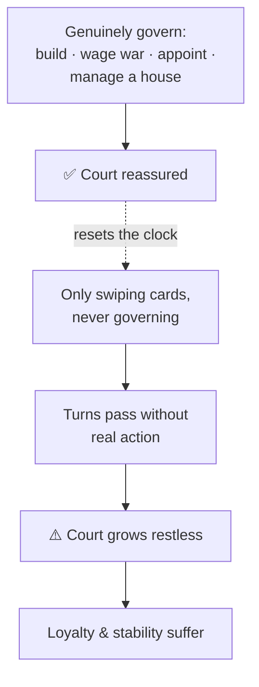

# 🏛️ The Royal Court

> 📌 *Game as of **29 June 2026** (beta) — details may change.*

Your **court** is the living world of people around the throne — relatives, officials, clergy and noble guests. It's where you appoint officers, manage intrigue, and keep the powerful happy.

## Courtiers

The court is full of named characters, each with skills, loyalty and ambitions. Some are your blood; some are heads of [[Noble Houses and Vassals|noble houses]]; some are clergy. You'll interact with them constantly — appointing them to office, befriending or pressuring them, marrying into their families, or scheming against them.

![[court-screen.png]]
*The society / court screen, where you read and manage the people around the throne.*

## Court neglect — use your realm, or lose it

Answering event cards is *not* the same as **ruling**. If you go too long without actively governing — never opening the map, the council, the economy or diplomacy to *do* something — your court grows restless. This is **court neglect**, and left unchecked it erodes your stability.

> [!tip] "Governing" means *doing*, not browsing
> Simply opening a menu doesn't count — you must take a real action (construct a building, appoint an officer, broker an alliance, manage a vassal). A short habit of acting each few turns keeps neglect away.

## What you do at court

- 🪑 Appoint and dismiss your great officers — see [[Your Council]].
- 🤝 Befriend, pressure or scheme against courtiers — see [[Intrigue and Schemes]].
- 💍 Arrange [[Marriage and Family|marriages]] to bind families to you.
- 👑 Manage the ambitions of powerful [[Noble Houses and Vassals|houses]] before they turn into factions.

## Why it matters

A well-tended court is loyal, productive and stable. A neglected one breeds discontent, plots and eventually open challenges to your rule. The court is where many threats *begin* — and where you can defuse them early.

---

*Next: [[Your Council]] · Related: [[Noble Houses and Vassals]], [[Intrigue and Schemes]].*
