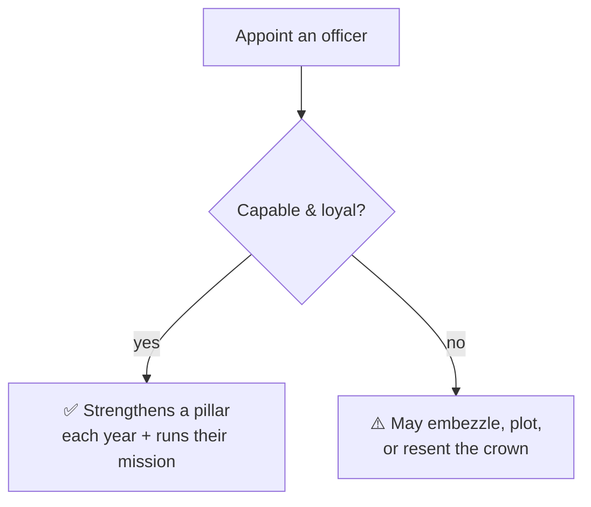

# 🪑 Your Council

> 📌 *Game as of **29 June 2026** (beta) — details may change.*

The **council** is your inner circle of officers. Appoint capable, loyal people and they strengthen the realm year after year — and each pursues a long-running **mission** that ties your systems together.

## The five great offices

| Office | Skill it uses | What a good holder does for you | Their standing mission |
|---|---|---|---|
| 🖋️ **Chancellor** | Diplomacy | Smoother diplomacy, stronger claims | Fabricates a **claim** on a hostile house (a reason to go to [[War]]) |
| ⚔️ **Marshal** | Martial | A stronger, readier army | **Drills the host** — raises troop morale and the war chest |
| 💰 **Steward** | Stewardship | Better income and growth | **Develops** one of your provinces |
| 🕵️ **Spymaster** | Intrigue | Uncovers secrets and threats | Finds **leverage** (a hook) over a rival — see [[Intrigue and Schemes]] |
| ⛪ **Chaplain** | Learning/Piety | Stronger faith and Church favour | **Spreads your faith** in a province — see [[Faith and Religion]] |

## Pick capable *and* loyal

A skilled, loyal officer is a steady blessing. A disloyal or over-mighty one can **embezzle**, **scheme**, or grow resentful — sometimes more dangerous in office than out of it. Weigh both skill and loyalty.

## Missions take time

Each officer's standing mission advances slowly — only when they're capable, and only every so often — so the benefits build up gradually rather than all at once. A patient chancellor eventually hands you a ready **claim**; a diligent steward visibly grows a province.

## Politics of appointment

Handing out offices isn't neutral. **Powerful houses left out of the council grow restless** and may demand a seat. Appointing and dismissing officers shifts how the [[Noble Houses and Vassals|noble houses]] feel about you. Use offices as rewards to keep the mighty content.

## Tips

- 🎯 Match the **person to the office** — a brilliant diplomat as Chancellor, a warrior as Marshal.
- 🤝 Keep an eye on **loyalty**, not just skill.
- 👑 Use seats to **appease powerful houses** before they form factions.
- ⏳ Let missions run — appoint and *leave* good officers in place.

---

*Next: [[Noble Houses and Vassals]] · Related: [[The Royal Court]], [[Intrigue and Schemes]].*
