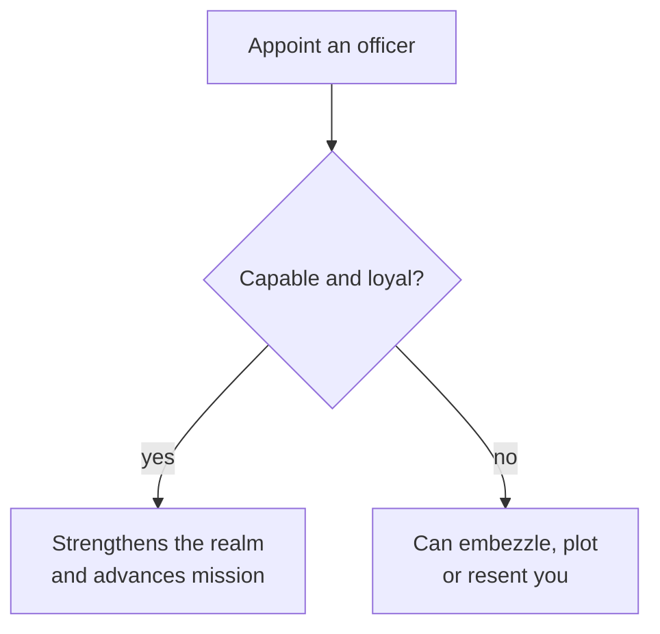

# Your Council

> *Game as of **30 June 2026** (beta) - details may change.*

The **council** is your inner circle of officers. Appoint capable, loyal people and they strengthen the realm year after year. Appoint careless, disloyal or over-mighty people and the same office can become a problem.

## The seven offices

| Office | Skill | Main value | Standing mission choices |
|---|---|---|---|
| **Chancellor** | Diplomacy | Popular order, relations and claims | Fabricate claims or improve relations |
| **Marshal** | Martial | Army readiness, morale and control | Drill troops or control hostile power |
| **Military Councillor** | Martial | Extra military support | Train or help control hostile houses |
| **Treasurer** | Stewardship | Gold, Treasury and development | Develop a province or collect taxes |
| **Financial Councillor** | Stewardship | Secondary economy support | Develop or collect taxes |
| **Chaplain / High Priest** | Learning | Faith authority and conversion | Convert provinces or build piety |
| **Spymaster** | Intrigue | Secrets and conspiracy control | Find hooks or disrupt plots |

The names and religious flavour can change with your rank and faith, but the jobs are the same strategic levers.

## Pick capable and loyal

A skilled officer makes their yearly effects stronger. Loyalty decides whether that skill works for you or against you.

## Missions take time

Council missions do not fire every turn. They advance on a slow yearly rhythm and often require the officer to meet a skill threshold. A good chancellor can mature a claim; a good treasurer or financial councillor can develop land; a good chaplain can slowly shift province faith.

## Politics of appointment

Offices are political rewards. Powerful landed houses may demand seats, and leaving them outside power can hurt relations or claims. Sometimes the best appointment is not the single highest stat, but the strongest compromise between skill, loyalty and house politics.

## Tips

- Match skill to office.
- Do not ignore loyalty.
- Use chancellors for claims before wars.
- Use marshal and military councillor before dangerous campaigns.
- Use treasurer and financial councillor before debt becomes a crisis.
- Keep a strong spymaster when factions or hooks matter.

---

*Next: [[Noble Houses and Vassals]] - Related: [[The Royal Court]], [[Intrigue and Schemes]].*
