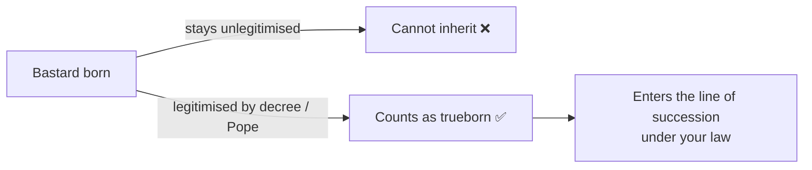

# 👶 Bastards

> 📌 *Game as of **29 June 2026** (beta) — details may change.*

Not every royal child is born in wedlock. **Bastards** are recognised children born outside marriage — and they sit under special rules.

## What a bastard can and can't do

- ❌ **Cannot inherit** the throne or titles under any normal [[Succession Laws|succession law]].
- ✅ **Can** be raised at court, given roles, and become part of family life.
- ✅ **Can** be **legitimised** — and then they inherit like any trueborn child.

A bastard is marked on their character card, and a legitimised one carries an honour that shows publicly (and lets them join the line of succession).

## How bastards appear

They usually arrive through events — a recognised child from an affair, or the result of a [[Intrigue and Schemes|seduction]] at court. Some events let you decide whether to recognise the child at all.

## Legitimising a bastard

When your trueborn line is thin or endangered, **legitimising** a bastard can rescue the dynasty. This is a formal act — sometimes by your own decree, sometimes blessed by the [[The Papacy|Pope]] — after which the child counts as a full heir.

> [!tip] A last-resort heir
> If plague or war has gutted your trueborn line, a legitimised bastard may be the only thing standing between you and [[Winning and Losing|extinction]]. Keep the option in mind before it's too late.

## Things to watch

- A legitimised bastard inherits **according to your current law** — for example, a son qualifies even under an agnatic (male-only) line.
- Recognising and legitimising children can ruffle the court and the clergy, so weigh the politics.

---

*Related: [[Your Dynasty and Heirs]], [[Succession Laws]], [[The Papacy]].*
