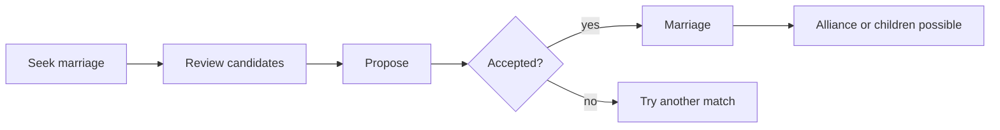

# Marriage and Family

> Game as of **30 June 2026** (beta). Details may change.

Marriage is how your dynasty makes its future: heirs, alliances, claims, faith continuity and a wider family network. The exact rules depend on your ruler's faith.

![[dynasty-screen.png]]
*The dynasty screen is where you manage family, marriages and heirs.*

## Finding a spouse

When your ruler can marry, the game offers candidates from noble and foreign houses. Candidates show age, house, faith and family power. A powerful match can bring an alliance; a local match can stabilize relations nearby.

The game blocks close blood relatives and underage spouses.

## Faith and marriage rules

Faith changes the shape of family strategy:

| Faith | Marriage rule |
|---|---|
| Christian | One living spouse |
| Jewish | One living spouse |
| Muslim | Male rulers may have up to four living spouses |

These rules matter most when succession is fragile. A Muslim male ruler can build a larger legitimate family faster, while Christian and Jewish rulers must plan around monogamy.

## Marriage as alliance

Marriage can create a true military alliance. An allied house cannot be attacked by you while the alliance holds and can add strength in war. For lower-rank starts, one strong marriage can be worth more than several early regiments.

See [[Diplomacy and Alliances]].

## Children and inheritance

Children inherit the dynasty's faith and culture, can gain traits from parents and events, and become candidates under your succession law. The first eligible child usually becomes heir if no heir exists.

> [!tip] Heirs are insurance
> Marry early. A ruler who dies without an eligible heir can end the dynasty, no matter how much land the house controls.

## Matchmaking for relatives

You can arrange marriages for close kin, not only for the reigning ruler. A well-married child, sibling or heir can create alliances, improve relations and shape the next generation. Childhood betrothals can mature when both partners come of age.

## Tips

- Marry early unless there is a clear political reason to wait.
- Look for faith, age, traits and alliance value, not just prestige.
- Keep at least one spare eligible heir when possible.
- Use relatives to build a diplomatic web before large wars.
- In Muslim realms, remember that family growth does not remove other succession risks, especially title eligibility rules.

---

*Next: [[Bastards]] - Related: [[Your Dynasty and Heirs]], [[Succession Laws]], [[Diplomacy and Alliances]].*
