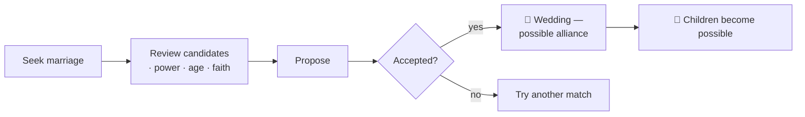

# 💍 Marriage and Family

> 📌 *Game as of **29 June 2026** (beta) — details may change.*

Marriage is how your dynasty makes its future: heirs, alliances, claims, and the faith and culture your children inherit.

![[dynasty-screen.png]]
*The dynasty screen, where you manage your family, marriages and heirs.*

## Finding a spouse

When your monarch is unwed, you can **seek a marriage**. The game offers you a list of **candidates**, ranked by their house's power, including:
- Members of noble houses (sometimes even your own house, never a close blood relative).
- **Foreign matches** from powerful families across and beyond Hispania.

Each candidate shows their age, house, faith and roughly how influential their family is. Picking a powerful match can bring a valuable **alliance**; picking a local match can bring loyalty.

## Marriage as alliance

A strong marriage can tie another house to you. Some matches create a genuine **military alliance** — a partner who stands with you in war and whom you can't attack. See [[Diplomacy and Alliances]].

## Children and inheritance

Once wed, you can **try for an heir**; childbirth events follow. Children:
- Inherit your dynasty's **faith and culture** (so a conversion carries down the generations).
- Pick up **traits** — some from their parents, some their own.
- The first child automatically becomes heir if you had none.

> [!tip] Heirs are insurance, not a luxury
> Marry and start a family *early*. A monarch who dies childless can end the whole dynasty. Several children are far safer than one.

## Matchmaking for your relatives

You don't only arrange your own marriage — you can broker matches for your **kin** (children, heirs, siblings) too. A well-married daughter or son extends your web of alliances and strengthens the family. Childhood betrothals can be set up to mature when both partners come of age.

## Rules of the heart (and the realm)

- 🚫 No marriages between close blood relatives.
- 👶 No one weds below a minimum age.
- ⛪ Faith matters: some faiths allow only one spouse, others permit secondary marriages. Your religion sets the rules — see [[Faith and Religion]].
- 🏳️‍🌈 A monarch's preferences are their own; formal weddings still follow the realm's customs, while other relationships can form through the [[Intrigue and Schemes|court]].

## Quick advice

1. 💍 Wed early; don't gamble your dynasty on a long bachelorhood.
2. 🤝 Use marriage to lock down a powerful ally before a war.
3. 👶 Aim for **two or three** children at least.
4. 🧬 Watch the traits and health of the children you're raising as heirs.

---

*Next: [[Bastards]] · Related: [[Your Dynasty and Heirs]], [[Diplomacy and Alliances]].*
