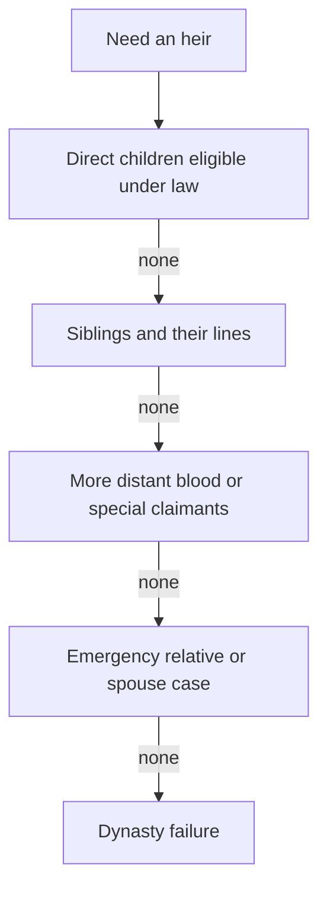

# Succession Laws

> Game as of **30 June 2026** (beta). Details may change.

Your succession law decides who inherits when a ruler dies. Because the game now supports different starting houses, ranks and faiths, the best law depends on the family you actually chose in [[Choosing Your Start]].

## The six laws

| Law | Who inherits | Best when... |
|---|---|---|
| Primogeniture | Eldest child, sons preferred | You want a predictable default |
| Absolute primogeniture | Eldest child, gender ignored | Your eldest should inherit no matter their sex |
| Agnatic | Only men of the bloodline | You have a secure male line |
| Cognatic | Eldest child, daughters preferred | You want to favour daughters |
| Elective | A strong eligible candidate | You value ability, claims or politics over strict birth order |
| Right of conquest | The strongest martial claimant | Your dynasty rules by force |

## How the line is searched

The exact order is shaped by the law. Agnatic skips women. Elective and conquest can reach beyond the direct firstborn line when politics or strength justify it.

## Faith restrictions

Faith can add eligibility rules on top of succession law:

- Muslim secular title holders must be male in the current implementation.
- Christian and Jewish realms do not use that Muslim secular-title restriction.
- Bastards normally cannot inherit unless legitimised.

This means a law that looks safe on paper can still fail if your faith and title rules make the apparent heir ineligible.

## Choosing wisely

- If you have only daughters, avoid agnatic law.
- If your eldest is clearly best, absolute primogeniture is simple and stable.
- If the direct heir is weak but the dynasty is broad, elective may save the realm.
- If you are playing a martial conquest run, right of conquest can match your strategy.
- If you are Muslim, keep eligible male heirs in mind for secular rule.

> [!tip] Match the law to the family you have
> Do not choose succession in the abstract. Open the dynasty view, look at actual children, siblings, sex, legitimacy, age and faith rules, then pick the law that leaves a living eligible heir.

## Bastards

Children born out of wedlock normally cannot inherit. Legitimation can rescue a succession crisis, especially for Christian rulers with papal access. See [[Bastards]] and [[The Papacy]].

---

*Next: [[Marriage and Family]] - Related: [[Your Dynasty and Heirs]], [[Bastards]], [[Faith and Religion]].*
