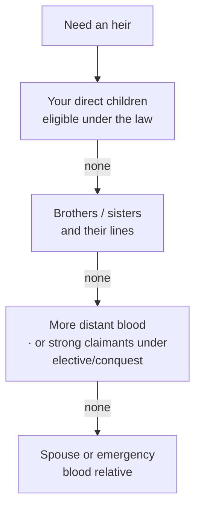

# 📜 Succession Laws

> 📌 *Game as of **29 June 2026** (beta) — details may change.*

Your **succession law** decides *who* inherits the throne. Choosing the right one for your family is a quietly powerful strategic lever. You can change it from the realm/laws menu.

## The six laws

| Law | Who inherits | Best when… |
|---|---|---|
| 👑 **Primogeniture** | Eldest child, **sons preferred** | The classic default — a solid all-rounder |
| ⚖️ **Absolute primogeniture** | Eldest child, **gender doesn't matter** | You want your eldest, son or daughter, every time |
| ♂️ **Agnatic** | **Only men** of the blood may inherit | You have strong sons and want a male line |
| ♀️ **Cognatic** | Eldest child, **daughters preferred** | You have capable daughters to favour |
| 🗳️ **Elective** | A strong candidate (even outside the direct line) | You value skill/claims over birth order |
| ⚔️ **Right of conquest** | The mightiest claimant by martial power | A warlord dynasty ruling by strength |

## How the line is searched

When a monarch dies, the game looks for an heir in a sensible order:

The exact order is shaped by your chosen law — for example, **agnatic** simply skips every woman, and **elective/conquest** can reach for a powerful candidate the other laws would ignore.

## Choosing wisely

- 👧 **All daughters, no sons?** Avoid **agnatic** — it can leave you heirless. Use **absolute** or **cognatic**.
- 🧠 **A brilliant cousin and a weak direct heir?** **Elective** lets merit win.
- ⚔️ **A martial, expansionist run?** **Conquest** rewards the strongest sword.
- 🤷 **Not sure?** **Primogeniture** or **absolute** are safe, predictable defaults.

> [!tip] Match the law to the family you have
> Don't pick a law in the abstract — look at your actual tree first. The "best" law is the one that puts a **capable, eligible heir** at the front of the line. A perfect law with no eligible heir is worse than a plain one with three.

## A note on bastards

Children born out of wedlock normally **cannot** inherit under any law — unless you **legitimise** them. See [[Bastards]].

---

*Next: [[Marriage and Family]] · Related: [[Your Dynasty and Heirs]], [[Bastards]].*
