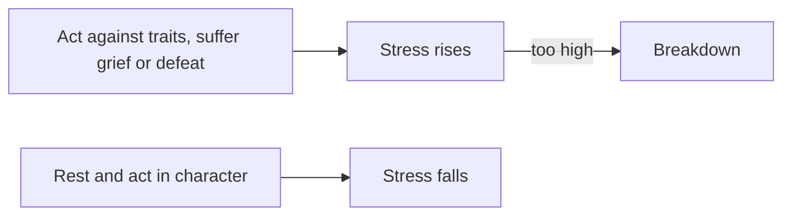

# Traits and Your Character

> Game as of **30 June 2026** (beta). Details may change.

Who your ruler is matters. Personality is not just flavour: it affects the realm, stress and the kind of choices that are easy or painful to make.

## Traits

Every character carries traits such as pious, bold, cruel, generous, scholarly, warlike or greedy. For the reigning ruler, traits can gently push the [[The Four Powers|Powers]] over time.

| If your ruler is... | The realm tends to... |
|---|---|
| Pious or a cleric | Gain faith authority |
| Warlike or a soldier | Gain Army strength |
| Merchant-minded or shrewd | Gain Treasury |
| Cruel or a warmonger | Gain Army but lose People or faith authority |
| Generous, just or charismatic | Gain People's love |
| Greedy or miserly | Lose People's goodwill |

The heir you raise is not only a name in the line of succession. Their traits will shape the next reign.

## Stress

Acting against your nature wears a ruler down. A pacifist forced into war, a generous ruler taxing hard, grief from a death or a humiliating defeat can all raise stress. Too much stress can cause a damaging breakdown.

> [!tip] There is a way down
> If stress is climbing, rest when the realm is calm and favour choices that fit your ruler's character.

## Lifestyle and growth

A ruler can pursue a focus that unlocks perks over the years, strengthening diplomacy, war, stewardship, intrigue or learning. Long reigns let a ruler grow into a specialist.

## Dread

Harsh rule builds dread: intimidation that discourages revolt. Dread fades unless renewed, and it works best beside lawful tools such as authority and hooks. See [[Crown Authority and Tyranny]].

## Raising the next generation

Children can be shaped by guardians and education. Since the child you raise may one day rule, guardianship is a long-term investment in your dynasty's future.

## Takeaways

- Play in character to keep stress manageable.
- Rest before stress becomes a breakdown.
- Give promising heirs good guardians.
- Use dread carefully; it decays and does not replace legitimacy.

---

*Related: [[The Four Powers]], [[Crown Authority and Tyranny]], [[Your Dynasty and Heirs]].*
