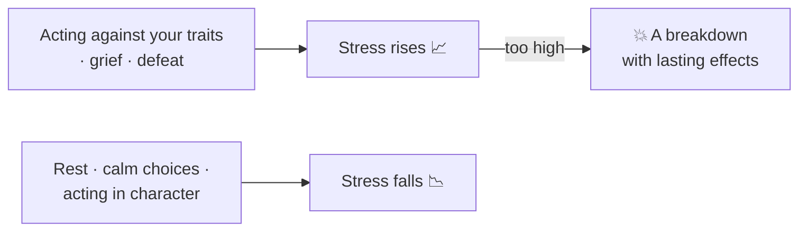

# 🧬 Traits and Your Character

> 📌 *Game as of **29 June 2026** (beta) — details may change.*

Who your monarch *is* genuinely matters. Personality isn't just flavour text — it tugs at the realm and at your own wellbeing.

## Traits

Every character carries **traits** — pious, bold, cruel, generous, scholarly, warlike, greedy, and many more, each with its own emblem on the character card. For the **reigning monarch**, traits gently push the [[The Four Powers|Powers]] over time:

| If your ruler is… | The realm tends to… |
|---|---|
| ⛪ Pious / a cleric | gain Church favour |
| ⚔️ Warlike / a soldier | gain Army strength |
| 💰 A merchant / shrewd | gain Treasury |
| 😈 Cruel / a warmonger | gain Army but lose People or Church |
| 🤝 Generous / just / charismatic | gain People's love |
| 🤑 Greedy / miserly | lose the People's goodwill |

So **who sits the throne** changes how the realm naturally drifts — a reason to care which heir you raise.

## Stress — the ruler's wellbeing

Acting **against your nature** wears a monarch down. A pacifist forced into war, a generous ruler taxing hard, grief from a loved one's death, or a humiliating defeat all raise **stress**. Too much stress can cause a damaging breakdown.

> [!tip] There is always a way down
> If stress is climbing, **rest** when the realm is calm, and favour choices that fit your ruler's character. You can always bring stress back down — don't let it spiral.

## Lifestyle and growth

A ruler can pursue a chosen **focus** that, over the years, unlocks lasting **perks** strengthening a pillar of rule (diplomacy, war, stewardship, intrigue or learning). Long reigns let a monarch genuinely *grow* into a specialist.

## Dread — rule by fear

Stern, harsh rule builds **dread** — an intimidation that discourages revolts. But dread **fades** unless you keep renewing it. It pairs with [[Crown Authority and Tyranny|authority and hooks]] as one of the ways to keep unruly vassals in line — the "fear" lever.

## Raising the next generation

Children can be shaped during childhood by a **guardian**, steering their **education** so they grow into their strongest skill. Since the heir you raise will one day rule (and tug the Powers with *their* traits), choosing good guardians is an investment in your dynasty's future.

## Takeaways

- 🧭 Play **in character** to keep stress low and the realm drifting your way.
- 🛌 **Rest** before stress peaks.
- 🎓 Give promising heirs good **guardians**.
- 😨 Use **dread** to deter revolts, but remember it decays.

---

*Related: [[The Four Powers]], [[Crown Authority and Tyranny]], [[Your Dynasty and Heirs]].*
