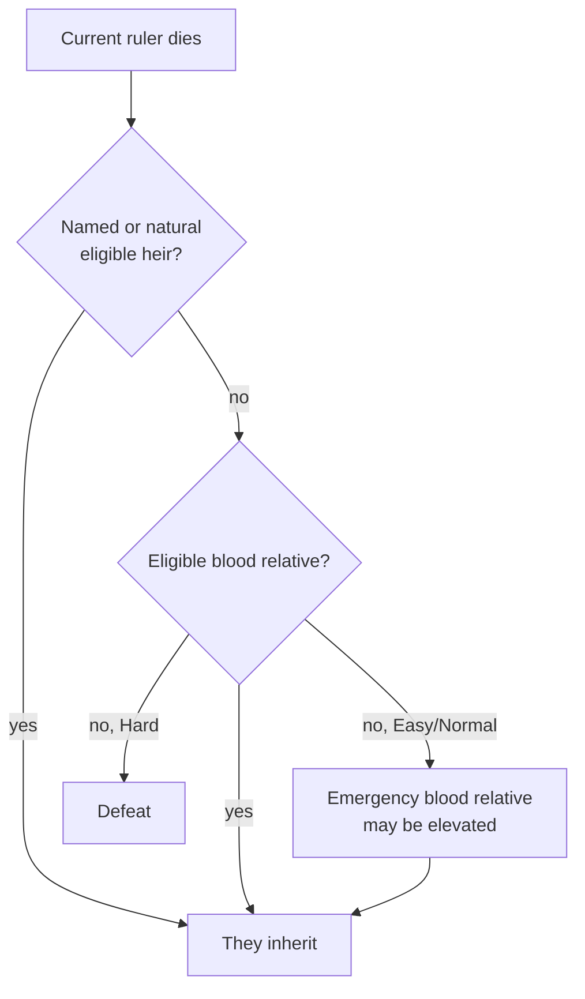

# Your Dynasty and Heirs

> *Game as of **30 June 2026** (beta) - details may change.*

In *Hispania Royal House*, you are not only one ruler. You are a **house across the centuries**. The start selector marks the house you chose as your bloodline, while its members keep their historical identity, names, culture, faith and titles.

## The dynasty tree

Every relative - spouse, children, siblings, cousins, in-laws and important house members - lives in your **family tree**. Each has age, traits, skills, faith, culture and succession relevance.

![[dynasty-tree.png]]
*The dynasty tree - your bloodline laid out across generations.*

## What is an heir?

An **heir** is the person who can continue the playable house when your current ruler dies. Who qualifies depends on your [[Succession Laws|succession law]], legitimacy, faith rules and living relatives.

## You can name your heir

From the dynasty menu you can designate an eligible relative as successor. This is useful when the default heir is weak, sickly, too young or politically dangerous. Eligibility still follows your law and faith.

## Faith changes succession

Most laws are about blood, gender and legitimacy, but faith can add rules. For example, an Islamic ruler's succession excludes women from secular inheritance in the current implementation. If you switch faiths, review the heir list immediately.

## Extinction

If your ruler dies and there is **no valid heir**, the selected house can fall and the run ends. The game is more forgiving on Easy and Normal, where a distant blood relative can sometimes rescue continuity. On Hard, plan as if no one will save you.

> [!warning] Keep the family wide
> A single heir is fragile. Plague, war, poison, bad childbirth timing or a succession accident can erase a narrow line. Several living legitimate relatives are much safer.

## A feudal safety net

Even after losing a great title, the game may try to leave your house a small **barony** foothold in its last lands. That is not victory, but it is survival: a chance to climb back through [[Climbing the Ladder]].

## How to keep the line secure

1. Marry early unless your house already has enough heirs.
2. Aim for several children and several adult relatives.
3. Watch traits, age and health when naming heirs.
4. Legitimise a [[Bastards|bastard]] if the legitimate line is in danger.
5. Change [[Succession Laws|succession law]] only after checking who would actually inherit.

---

*Next: [[Succession Laws]] - Related: [[Marriage and Family]], [[Bastards]].*
