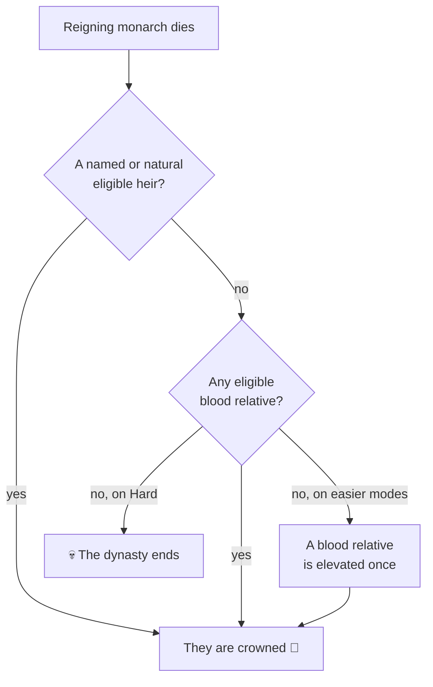

# 👨‍👩‍👧 Your Dynasty and Heirs

> 📌 *Game as of **29 June 2026** (beta) — details may change.*

In *Hispania Royal House*, **you are not a single king — you are a family across the centuries.** Individual monarchs are chapters; the dynasty is the book. Keeping that book open is your single most important job.

## The dynasty tree

Every relative — your spouse, children, siblings, cousins, even foreign in-laws — lives in your **family tree**. Each has an age, traits, skills and a place in the line of succession. You can open the tree to see who's who, who's healthy, who's a potential heir, and who might cause trouble.

![[dynasty-tree.png]]
*The dynasty tree — your bloodline laid out across the generations.*

## What is an heir?

An **heir** is the person who will inherit the throne when your current monarch dies. The game always tries to have one ready. Who it is depends on your **[[Succession Laws|succession law]]** and your living relatives.

## You can name your heir

You don't have to accept the default. From the dynasty menu you can **designate** an eligible relative as your chosen successor — useful when the natural heir is a sickly child, has terrible traits, or you prefer a more capable cousin. The available choices depend on your [[Succession Laws|law]].

## The nightmare: extinction

If a monarch dies and there is **no valid heir at all**, the game is over — the House of Pelayo falls and history forgets you. This is the true lose condition (alongside being overthrown). See [[Winning and Losing]].

> [!warning] Keep the family wide, not just deep
> A single sickly heir is fragile. Plague, war and accidents can wipe out a narrow line in a few turns. A dynasty with **several** living relatives is far safer — there's always someone to inherit.

## A feudal safety net

Even if you lose your throne or your last great title, the game tries not to end the dynasty prematurely: a fallen monarch can be left with a small **holding** (a barony) in their last lands, giving you a feudal second chance to climb back up. See [[Climbing the Ladder]].

## How to keep the line secure

1. 💍 **Marry early** — no spouse, no legitimate children. See [[Marriage and Family]].
2. 👶 **Have several children**, not just one. Aim for an heir *and* spares.
3. 🧬 Mind their **[[Traits and Your Character|traits and health]]** — raise capable, stable heirs.
4. 🛡️ Consider **legitimising a [[Bastards|bastard]]** if your legitimate line is in danger.
5. 📜 Pick a **[[Succession Laws|succession law]]** that fits the family you actually have.

---

*Next: [[Succession Laws]] · Related: [[Marriage and Family]], [[Bastards]].*
