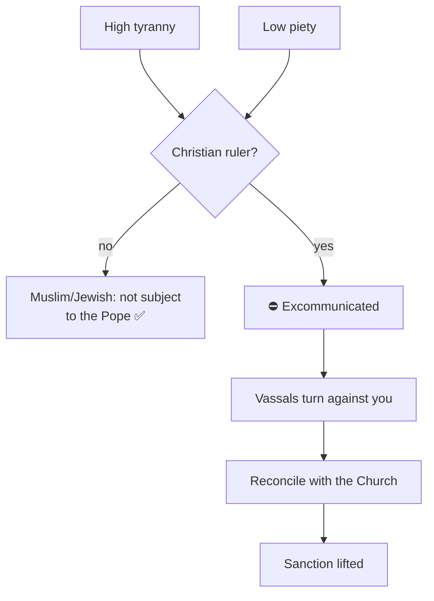

# 📜 Doctrines and Excommunication

> 📌 *Game as of **29 June 2026** (beta) — details may change.*

Faith isn't only about who you pray to — it's something you can **shape and be judged by**.

## Doctrines — the character of your faith

You can adopt permanent **doctrines** (tenets) that give your realm a distinct religious character. Each:
- Is **paid for with your Church standing**.
- Grants a **lasting benefit** that keeps paying off year after year.
- Is flavoured to your faith.

Doctrines are one of three long-term, permanent upgrade paths in the game, alongside [[Culture and Innovations|cultural innovations]] and [[Dynasty Legacy|dynasty legacies]] — slow investments that make every future ruler stronger.

## Excommunication — the Church's ultimate sanction

For a **Christian** ruler, faith comes with a sword over your head. If you grow **tyrannical and impious** — ruling cruelly while neglecting your devotion — you risk the **interdict**: the Pope excommunicates you.

While excommunicated, your vassals turn against you and your rule is in peril — until you **reconcile** with the Church (an act of contrition that restores you).

> [!warning] Tyranny + impiety is a deadly mix
> The way to avoid the interdict is simple: don't pile up [[Crown Authority and Tyranny|tyranny]] while letting your piety collapse. If you must be ruthless, do it lawfully (with a [[Intrigue and Schemes|hook]]) and keep the Church on side.

## Reminder: it's a Christian rule

Muslim and Jewish crowns aren't subject to the Pope and can't be excommunicated — but they answer to their own faith's expectations. See [[Faith and Religion]] and [[The Papacy]].

## Tips

- 📜 Spend spare **Church standing** on a doctrine for a permanent edge.
- ⛪ As a Christian, keep **piety up** and **tyranny down** to avoid the interdict.
- 🤝 If excommunicated, **reconcile** quickly before your vassals revolt.

---

*Related: [[Faith and Religion]], [[The Papacy]], [[Crown Authority and Tyranny]].*
