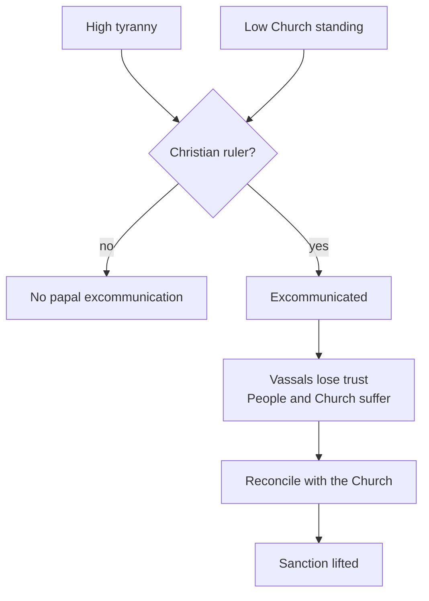

# Doctrines and Excommunication

> *Game as of **30 June 2026** (beta) - details may change.*

Faith is not only a label. You can shape it through permanent **doctrines**, and Christian rulers can also be judged by Rome.

## Doctrines

Doctrines are long-term faith choices. Each costs faith authority, becomes permanent for the realm, and gives a recurring benefit.

| Faith group | Doctrine themes |
|---|---|
| **Christian** | Crusade, Tithe, Monasticism |
| **Islamic** | Jihad, Zakat, Madrasa |

You can hold up to **three** doctrines. They are one of the permanent-progress paths alongside [[Culture and Innovations|innovations]] and [[Dynasty Legacy|legacies]].

## What doctrines do

- Tithe or Zakat improves Treasury over time.
- Monasticism or Madrasa improves faith authority over time.
- Crusade or Jihad helps Army while you are at war.

They are slow advantages, not emergency buttons. Adopt them when your faith authority can afford the cost.

## Excommunication

Only Christian rulers can be excommunicated. The risk rises when tyranny is high and Church standing is low.

While excommunicated, your vassals become more hostile and the realm bleeds stability until you reconcile.

> [!warning] Tyranny plus impiety is a deadly mix
> If you must rule harshly, use lawful tools such as hooks and keep Church standing healthy.

## Tips

- Buy doctrines in calm periods, not during a crisis.
- Christian rulers should keep tyranny and Church standing apart: high tyranny plus low piety invites disaster.
- Muslim and Jewish rulers do not answer to the Pope, but still need strong faith authority for stability and conversion.

---

*Related: [[Faith and Religion]], [[The Papacy]], [[Crown Authority and Tyranny]].*
