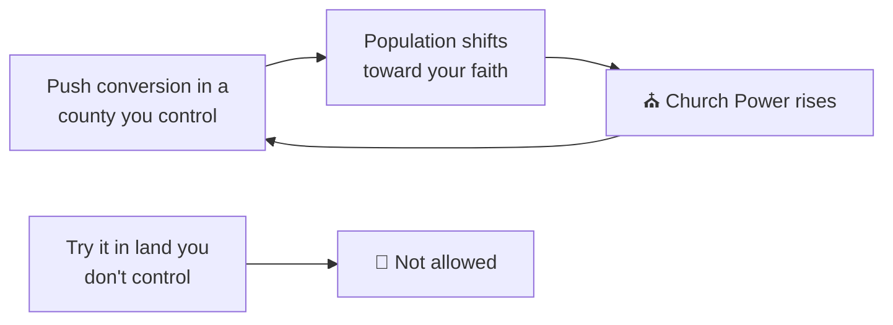

# ☪️✝️ Faith and Religion

> 📌 *Game as of **29 June 2026** (beta) — details may change.*

In the world of the Reconquista, faith is everywhere — in your marriages, your wars, your legitimacy, and the loyalty of your people. It works on two levels: **your ruler's own religion**, and the **religion of your provinces' populations**.

## Your ruler's faith

Your monarch follows a faith — Christian, Muslim or Jewish — and it shapes the rules you live by:
- 💍 **Marriage customs** — some faiths allow only one spouse, others permit secondary marriages (see [[Marriage and Family]]).
- ⛪ **The [[The Papacy|Pope]]** — only Christian rulers answer to Rome (and can be excommunicated).
- 🧬 **Inheritance** — your children inherit the dynasty's faith, so a conversion echoes down the generations.

Bold rulers can even **convert** the whole realm's faith through dramatic events — a momentous, identity-changing choice.

## Converting your provinces

The people of a province have their own religious make-up. You can **spread your faith** in counties **you actually control**, gradually shifting the population toward your religion.

- The stronger your **[[The Four Powers|Church]]** standing, the more effective each push.
- Converting people in turn **raises your Church Power**.
- You can only push **once per season per province**, so it's a steady campaign, not an instant flip.

Your [[Your Council|chaplain]] can also spread the faith automatically as their standing mission.

## Why bother converting?

A realm united in your faith is more loyal and more stable, strengthens your Church standing, and removes a source of unrest. As you conquer south into [[The Map of Hispania|al-Andalus]], converting your new lands is part of consolidating them.

## Tips

- ⛪ Keep your **Church Power** healthy to make conversions effective.
- 🗺️ Convert lands **after** you secure them — you can only work in what you hold.
- 🧬 Remember conversions and faith pass to your **heirs**.

---

*Next: [[The Papacy]] · Related: [[Doctrines and Excommunication]], [[Marriage and Family]].*
