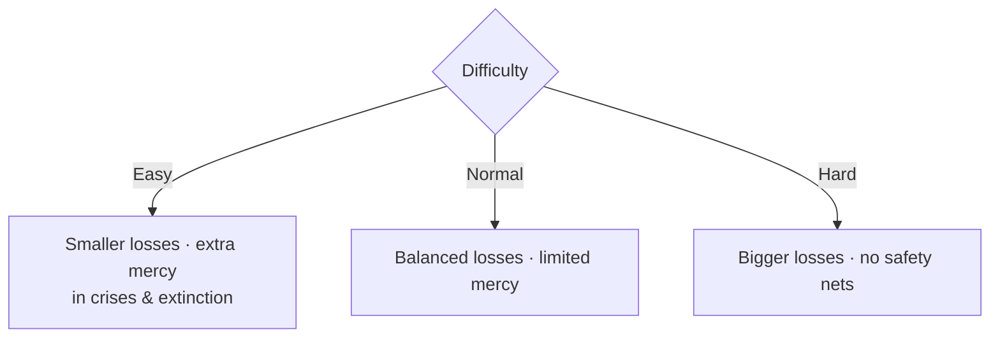

# 🎚️ Difficulty

> 📌 *Game as of **30 June 2026** (beta) — details may change.*

You choose a difficulty when you begin. It doesn't change *what* the game is — it changes how **forgiving** it is.

## The three settings

| Setting | Losses | Safety nets | Feel |
|---|---|---|---|
| 🟢 **Easy** | Softened — bad outcomes hurt less | Most generous | A relaxed way to learn the systems |
| 🟡 **Normal** | Balanced | Some | The intended experience |
| 🔴 **Hard** | Amplified — setbacks bite harder | Fewest | A real test for veterans |

## What actually changes

- 📉 **Loss scaling** — negative outcomes from your choices are reduced on Easy and magnified on Hard.
- 🧬 **Extinction mercy** — on Easier modes, a dying-out dynasty can sometimes elevate a blood relative to survive once. On **Hard**, extinction is final — no last-minute heir. See [[Your Dynasty and Heirs]].
- 🩹 **Crisis reprieve** — on Easier modes, a collapsing reign can get a one-time rescue from a [[Crises and Disasters|crisis]]. On **Hard**, a sustained collapse simply ends you.

## Which should you pick?

- 🆕 **New to the game?** Start on **Easy** or **Normal** to learn the systems without harsh punishment.
- 🎯 **Want the intended challenge?** **Normal**.
- 🏆 **Experienced and want stakes?** **Hard** — where every heir, every coin and every crisis truly matters.

> [!tip] The fundamentals don't change
> Whatever the difficulty, the same habits win: keep the [[The Four Powers|Powers]] balanced, secure your [[Your Dynasty and Heirs|heirs]], and stay solvent. Hard just punishes mistakes you'd survive on Normal.

---

*Related: [[Strategy and Tips]], [[Crises and Disasters]], [[Your Dynasty and Heirs]].*
