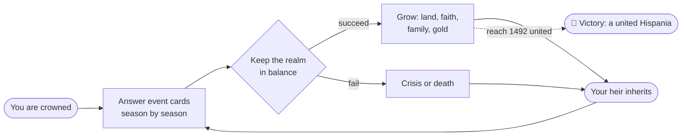

![[banner.jpg]]

# 👑 Hispania Royal House — Player's Guide

Welcome, Your Majesty. This is the **complete player's guide** to *Hispania Royal House* — a game where you rule a royal dynasty across **770 years of medieval Spain**, from the mountains of Asturias in the year **722** to the gates of Granada in **1492**.

You don't command armies tile-by-tile or micro-manage spreadsheets. You **rule by decision**: courtiers, bishops, generals and rivals come to you, card by card, and you choose. Every choice ripples outward — into your treasury, your faith, your armies, and the survival of your bloodline. When one monarch dies, you continue as their heir. The dynasty is the real hero of the story.

> [!warning] Please read — this guide is a snapshot
> This guide describes the game **as of 29 June 2026**, while it is in **beta** and under active development. Exact numbers, rules, menus and screens **may change** in later versions. Treat everything here as "how it works right now," not a permanent contract. When in doubt, trust what the game shows you.

---

## 🧭 New here? Start with these

- 🃏 [[How to Play]] — the absolute basics in five minutes.
- ⚖️ [[The Four Powers]] — the four bars that decide whether you keep your crown.
- 👶 [[Your Dynasty and Heirs]] — children, heirs, and not going extinct.
- 🏆 [[Winning and Losing]] — what you're actually trying to achieve.
- 💡 [[Strategy and Tips]] — how to survive your first reigns.

---

## 📚 Full guide

### Getting started
- [[How to Play]]
- [[The Four Powers]]
- [[Making Decisions]]
- [[Time and Your Lifespan]]

### Your dynasty
- [[Your Dynasty and Heirs]]
- [[Succession Laws]]
- [[Marriage and Family]]
- [[Bastards]]
- [[Traits and Your Character]]

### Court & politics
- [[The Royal Court]]
- [[Your Council]]
- [[Noble Houses and Vassals]]
- [[Crown Authority and Tyranny]]
- [[Intrigue and Schemes]]

### Your realm
- [[The Map of Hispania]]
- [[Climbing the Ladder]]
- [[War]]
- [[Armies and Men-at-Arms]]
- [[Diplomacy and Alliances]]
- [[Economy and Gold]]

### Faith
- [[Faith and Religion]]
- [[The Papacy]]
- [[Doctrines and Excommunication]]

### The wider world
- [[Culture and Innovations]]
- [[Dynasty Legacy]]
- [[Relics and Treasures]]
- [[Crises and Disasters]]

### Mastery
- [[Winning and Losing]]
- [[Achievements]]
- [[Strategy and Tips]]
- [[Difficulty]]
- [[Glossary]]
- [[FAQ]]

---

## 🌍 The fantasy in one picture

Every monarch is one chapter. The **goal** is to keep the bloodline going, expand your realm, and — if you're bold — **reunite all of Hispania under your crown** before history closes the book in 1492. See [[Winning and Losing]].

> [!example] The throne room
> This is where you'll spend most of your reign — reading event cards and balancing the [[The Four Powers|four Powers]] shown at the top.
>
> ![[main-screen.png]]

---

*A fan-style player's guide. Hispania Royal House is in beta — see the disclaimer above.*
