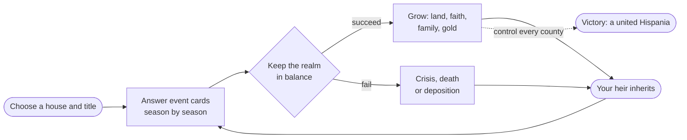

![[banner.jpg]]

# Hispania Royal House - Player's Guide

Welcome. This is the **player's guide** to *Hispania Royal House*: a dynasty game about choosing a medieval Iberian house, surviving from **722** to **1492**, and trying to bring all of Hispania under one line.

You do not command armies tile by tile. You **rule by decision**. Courtiers, clergy, generals, merchants and rivals come to you as cards, and each choice shifts your faith authority, people, army, treasury, family and map position. When one ruler dies, the story continues through an heir if the house survives.

> [!warning] Please read - this guide is a snapshot
> This guide describes the game **as of 30 June 2026**, reviewed against the current *Crowns of hispania* codebase after the `fa24e89` wiki baseline. The game is in beta and under active development, so exact numbers, rules, menus and screens may change. When in doubt, trust what the game shows you.

---

## New here? Start with these

- [[How to Play]] - the absolute basics in five minutes.
- [[Choosing Your Start]] - kingdoms, duchies, counties, baronies and faith filters.
- [[The Four Powers]] - the four bars that decide whether your rule survives.
- [[Your Dynasty and Heirs]] - children, heirs and not going extinct.
- [[Winning and Losing]] - the real victory and defeat conditions.
- [[Strategy and Tips]] - how to survive your first reigns.

---

## Full guide

### Getting started
- [[How to Play]]
- [[Choosing Your Start]]
- [[The Four Powers]]
- [[Making Decisions]]
- [[Time and Your Lifespan]]

### Your dynasty
- [[Your Dynasty and Heirs]]
- [[Succession Laws]]
- [[Marriage and Family]]
- [[Bastards]]
- [[Traits and Your Character]]

### Court & politics
- [[The Royal Court]]
- [[Your Council]]
- [[Noble Houses and Vassals]]
- [[Crown Authority and Tyranny]]
- [[Intrigue and Schemes]]

### Your realm
- [[The Map of Hispania]]
- [[Climbing the Ladder]]
- [[War]]
- [[Armies and Men-at-Arms]]
- [[Diplomacy and Alliances]]
- [[Economy and Gold]]

### Faith
- [[Faith and Religion]]
- [[The Papacy]]
- [[Doctrines and Excommunication]]

### The wider world
- [[Culture and Innovations]]
- [[Dynasty Legacy]]
- [[Relics and Treasures]]
- [[Crises and Disasters]]

### Mastery
- [[Winning and Losing]]
- [[Achievements]]
- [[Strategy and Tips]]
- [[Difficulty]]
- [[Glossary]]
- [[FAQ]]

---

## The fantasy in one picture

Every ruler is one chapter. The **goal** is to keep your chosen house alive, stay landed, grow through the feudal ladder, and eventually **unite every county of Hispania under your house** before the era closes in 1492. Granada remains the classic historical milestone, but the sandbox victory now follows actual control of the peninsula. See [[Winning and Losing]].

> [!example] The throne room
> This is where you will spend most turns: reading event cards and balancing the [[The Four Powers|four Powers]] shown at the top.
>
> ![[main-screen.png]]

---

*A fan-style player's guide. Hispania Royal House is in beta - see the disclaimer above.*
