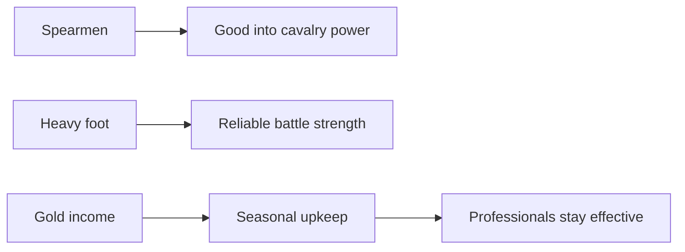

# Armies and Men-at-Arms

> Game as of **30 June 2026** (beta). Details may change.

Your strength in [[War]] comes from your lands, ruler, allies, rank and professional soldiers. Men-at-arms are powerful, but they cost real gold every season.

## Levies vs. professionals

| Type | What they are | Notes |
|---|---|---|
| Levies | The broad feudal host raised from your lands | Cheap, numerous and tied to realm strength |
| Men-at-arms | Professional spearmen and heavy foot | Smaller, stronger and expensive to maintain |

Levies give bulk. Professionals give a reliable edge when a war is close.

## Regiment types

| Regiment | Recruit cost | Men gained | Best use |
|---|---:|---:|---|
| Spearmen | 40 gold | 12 | Countering cavalry-heavy or militarily powerful enemies |
| Heavy foot | 55 gold | 9 | Reliable strength in most battles |

Seasonal upkeep is based on the total number of professional soldiers: roughly **1 gold per 8 men-at-arms each season**. If you cannot pay, regiments can shrink and morale suffers.

## What decides war strength

The war system compares more than raw soldier count:

- Rank and title weight: kingdoms project more force than duchies, counties or baronies.
- Land and holdings controlled by each side.
- Men-at-arms, morale and war chest.
- Allies and pacts.
- Council preparation, especially marshal and military councillor work.
- The target's own stability and internal problems.

This is why a wealthy county with allies can survive, while a poor kingdom can look stronger than it really is.

## Tips

- Recruit spearmen before fighting a cavalry-heavy rival.
- Use heavy foot when you need general-purpose strength.
- Do not recruit professionals your economy cannot pay.
- Drill and prepare before declaring. A claim is not the same thing as readiness.
- Lower-rank starts should treat men-at-arms as a decisive tool, not a standing luxury.

---

*Next: [[Diplomacy and Alliances]] - Related: [[War]], [[Economy and Gold]], [[Your Council]].*
