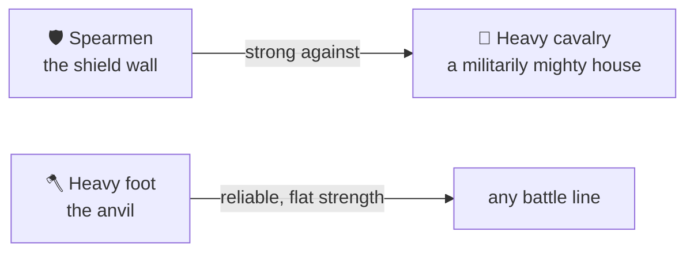

# 🛡️ Armies and Men-at-Arms

> 📌 *Game as of **29 June 2026** (beta) — details may change.*

Your fighting strength in [[War]] comes from two very different kinds of soldier.

## Levies vs. professionals

| Type | What they are | Notes |
|---|---|---|
| 🚜 **Levies** | The mass feudal host — peasants, archers, riders called up for war | Numerous but ordinary |
| 🛡️ **Men-at-arms** | Small **professional** regiments — spearmen and heavy foot | Few, but punch far above their numbers |

Levies give you bulk; men-at-arms give you a hard, reliable edge — at a price.

## The counter that matters

Professional regiments aren't just stronger — they **counter** specific enemies:

- **Spearmen** are the shield wall — especially strong against a foe that fields heavy horse (a militarily powerful house).
- **Heavy foot** are the anvil — dependable strength in any fight.

Knowing your enemy lets you bring the right regiments.

## They cost real money

Men-at-arms are **expensive to raise and to keep**. You recruit them with gold, and they draw **upkeep every season from your war chest**. If you can't pay them, they **desert** — your regiments shrink and morale drops. Professional soldiers are a serious, ongoing commitment, not a one-time purchase.

> [!tip] Quality you can afford
> A handful of well-paid spearmen can decide a war — but only if your [[Economy and Gold|treasury]] can sustain them. Don't recruit an army you'll have to watch desert.

## Strengthening your host

Your [[Your Council|marshal]] can drill the troops over time, raising morale and building the war chest. A strong economy, a capable marshal and the right counters together make you formidable.

## Tips

- 🐎 Facing a cavalry-heavy enemy? Field **spearmen**.
- 💰 Only keep as many professionals as you can **pay** each season.
- 🏋️ Let your **marshal** drill the host between wars.
- ⚖️ Remember the [[The Four Powers|Army Power]] bar reflects your overall martial standing — keep it healthy but not over-mighty.

---

*Next: [[Diplomacy and Alliances]] · Related: [[War]], [[Economy and Gold]].*
