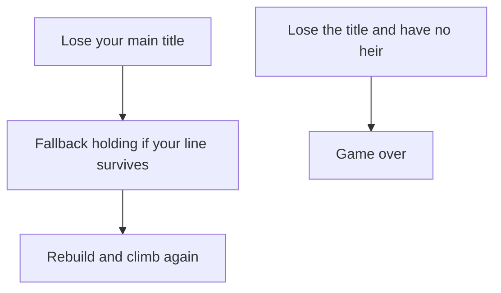

# Climbing the Ladder

> Game as of **30 June 2026** (beta). Details may change.

Your rank is no longer fixed by the old Asturias-only opening. In a new campaign you can begin as a **baron**, **count**, **duke** or **king** through [[Choosing Your Start]], then climb from there.

## The four rungs

Christian and Muslim realms use different title language, but the mechanical ladder is the same:

| Rank | Christian-style title | Muslim-style title |
|---|---|---|
| Barony | Barony | Hisn |
| County | County | Cora |
| Duchy | Duchy | Wilaya |
| Kingdom | Kingdom | Emirate |

Your rank shapes war scope, diplomacy, succession pressure and how exposed you are. A king can fight larger wars and command more resources; a baron has fewer tools, but fewer expectations and a clearer path upward.

## Three roads up

You climb by acquiring titles through any mix of:

- **War** - press claims, win wars and take land by force. See [[War]].
- **Diplomacy** - marriages, alliances, inheritances and favours can move titles into your house. See [[Diplomacy and Alliances]].
- **Intrigue** - plots against lieges and rivals can shift power without a formal battlefield. See [[Intrigue and Schemes]].

These are long paths with progress and risk. A single lucky card may open a door, but actually rising usually takes years of preparation.

> [!tip] Title vs. land
> Winning a higher title and controlling enough land to support it are different things. A claimed crown with few real provinces behind it is fragile. Back every promotion with territory, allies and money.

## Starting lower

A lower-rank start is a different campaign, not just a harder version of the old one:

- You begin with a smaller economy and fewer troops.
- Your legal war targets are narrower.
- A good marriage or alliance matters more.
- The first promotion often matters more than early conquest.

Starting as a count or baron is ideal if you want a personal rise through the feudal ladder. Starting as a king is better if you want immediate grand strategy.

## The feudal safety net

Falling is not always the end. If you lose your main title, the game may leave your dynasty a small foothold, often a barony in your final lands. As long as the [[Your Dynasty and Heirs|bloodline]] survives, the story can continue.

## Tips

- Start at the rank that matches the campaign you want: survival, ascent or grand strategy.
- Keep a claim, a marriage plan and a cash reserve moving at the same time.
- Do not chase an empty promotion. Rank without land, allies or gold invites collapse.
- A surviving heir and one small holding can still become a comeback.

---

*Next: [[War]] - Related: [[The Map of Hispania]], [[Choosing Your Start]], [[Intrigue and Schemes]].*
