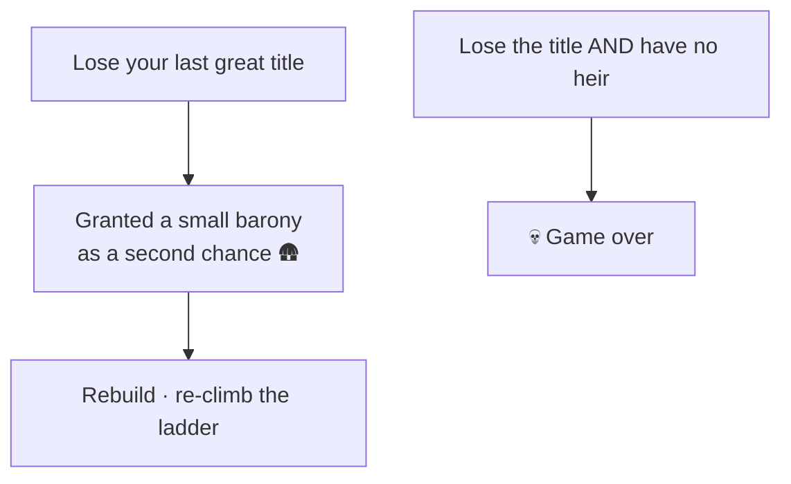

# 🪜 Climbing the Ladder

> 📌 *Game as of **29 June 2026** (beta) — details may change.*

Your rank isn't fixed. A core fantasy of the game is **rising through the feudal ranks** — from a humble baron all the way to a king who unites Hispania.

## The four rungs

Your title changes how you're addressed and what you can do — a king can wage grander wars and command more, but also has more to lose.

## Three roads up

You climb by acquiring titles, through any mix of:
- ⚔️ **War** — conquer the lands of a title and take it by force. See [[War]].
- 🤝 **Diplomacy** — marriages, alliances and inheritance can bring titles to your house. See [[Diplomacy and Alliances]].
- 🗡️ **Intrigue** — long **title plots** against your liege can win you a rank without open battle. See [[Intrigue and Schemes]].

These are deliberately **long paths with progress and risk** — not something that happens in a single lucky card.

> [!tip] Title vs. land
> Winning a higher *title* and actually controlling the *land* of that tier aren't always the same thing. A claimed crown with few real provinces behind it is a shaky one. Aim to back your titles with genuine territory.

## The feudal safety net

Falling isn't always the end. If you lose your throne or your last great title, the game tries to leave your dynasty a small **barony** in your final lands — a foothold from which you can begin the climb again. As long as the [[Your Dynasty and Heirs|bloodline]] survives, the story can continue.

## Tips

- 🧱 **Back titles with land** — don't chase an empty crown.
- 🐢 Treat ascent as a **campaign**, not a single move.
- 🛡️ Even after a fall, a surviving barony plus a living heir means you're still in the game.

---

*Next: [[War]] · Related: [[The Map of Hispania]], [[Intrigue and Schemes]].*
