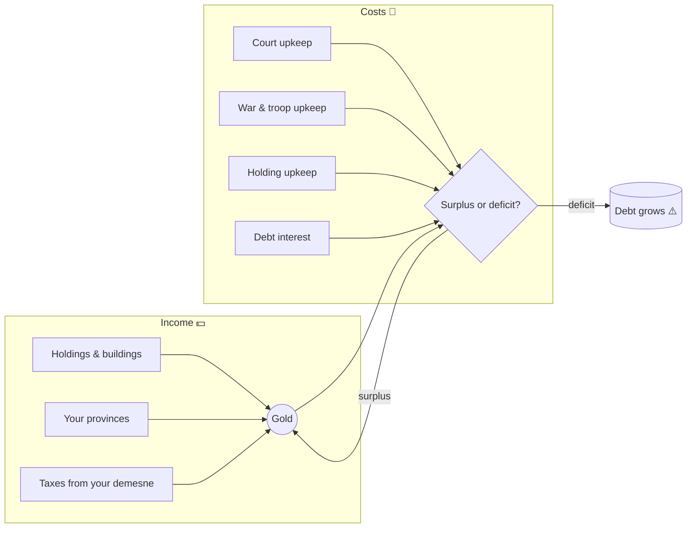

# 💰 Economy and Gold

> 📌 *Game as of **29 June 2026** (beta) — details may change.*

Underneath the [[The Four Powers|Treasury]] bar sits a real economy of **gold and debt**. Master it and you can fund wars, buildings and a lavish court; neglect it and bankruptcy will topple you.

![[economy-screen.png]]
*The economy screen — your gold, debt, holdings and the options to build, borrow and repay.*

## Gold vs. the Treasury bar

- 💰 **Gold** is your actual money — earned, spent, saved and owed.
- 📊 The **Treasury bar** is a *reflection* of your financial health (your gold, your debt, your income). Healthy finances push the bar up; debt drags it down.

So building real wealth is what keeps that bar green.

## Where money comes from and goes

- 💵 **Income** grows with your lands, their development, and the buildings you own.
- 💸 **Costs** include your court, your soldiers (especially [[Armies and Men-at-Arms|men-at-arms]]), war, and interest on any debt.

## Buildings and holdings

You can **buy productive holdings** — mills, markets, estates and more — that raise your income, and sell them if you need cash. Each has a cost, a resale value and a year it becomes available. Noble houses build up their own economies too, which is part of what makes them powerful.

## Borrowing and debt

Short of cash? You can **borrow** — but loans come due with **interest**, and there's a limit based on what you can repay. Debt is a tool, not a free lunch.

## Bankruptcy — a real lose condition

Let debt spiral and you become **insolvent**. Persistent insolvency can **topple the reigning monarch**. The one mercy: if you have an heir, the crisis usually passes to them with the books partly cleared, rather than ending the dynasty outright. With **no heir**, bankruptcy can be game over.

> [!warning] Debt is patient and pitiless
> A war funded entirely on loans can win the battle and lose the dynasty. Keep a reserve, repay when you can, and don't let interest snowball.

## Tips

- 🏗️ **Invest** in holdings during peacetime to grow steady income.
- 💰 Keep a **cash reserve** before wars.
- 🧾 **Borrow** sparingly and repay from surplus.
- 🪖 Only keep as many [[Armies and Men-at-Arms|professional troops]] as your income sustains.

---

*Related: [[The Four Powers]], [[Armies and Men-at-Arms]], [[Crises and Disasters]].*
