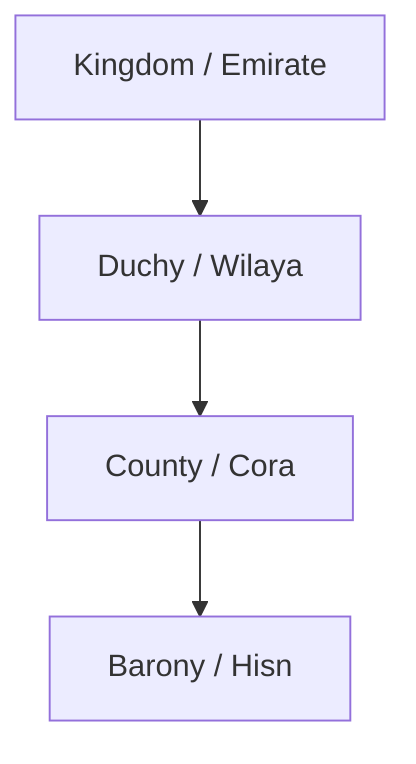
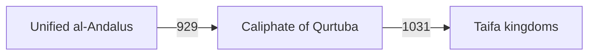

# The Map of Hispania

> Game as of **30 June 2026** (beta). Details may change.

The map is your realm made visible: the provinces you hold, the houses around you and the lands you might conquer, protect, build in or scheme over.

![[map-screen.png]]
*The map of Hispania lets you switch layers, select provinces and plan expansion.*

## How land is organized

Hispania is a ladder of titles:

- **County / province** - the basic land unit for conquest and economy.
- **Duchy / wilaya** - a regional title grouping several counties.
- **Kingdom / emirate** - the top playable title tier.
- **Barony / hisn** - a small holding inside a county, secular or religious.

Your playable rank comes from the highest title your house holds. See [[Climbing the Ladder]].

## Playable starts

The map is no longer built around one fixed player faction. In a new game, you can start from any valid playable title offered by [[Choosing Your Start]]: kingdom, duchy, county or barony, Christian or Islamic. The game moves player control to the historical house that holds that title while leaving the rest of the world intact.

That means "your realm" is always relative to the house you chose. A province is yours only if your player house holds it.

## The 722 world

At the beginning, Iberia is broadly split between:

| World | What it means |
|---|---|
| Asturias and the Christian north | The recommended kingdom start and several smaller northern houses |
| Navarre and Pyrenean lords | Mountain powers around the upper Ebro and Pyrenees |
| al-Andalus | The large Muslim realm across much of the centre and south |

You can follow the classic northern Reconquista arc, start as a smaller Christian house or choose an Islamic title and write a different history.

## al-Andalus, caliphate and taifas

Early al-Andalus is protected from ordinary conquest while unified. In **929**, if it still holds together, it becomes the **Caliphate of Qurtuba**. In **1031**, it can break into **taifa** kingdoms.

If the player house controls unified al-Andalus when fragmentation hits, it keeps one playable taifa and the rest is distributed among local powers. After **1086** and **1147**, outside Muslim powers can sometimes absorb weak Muslim-held taifas unless protected by alliances or changed circumstances.

## What you do on the map

- Declare and fight [[War]] for counties, duchies or kingdoms.
- Select one of your own counties to build in through [[Economy and Gold]].
- Use [[Diplomacy and Alliances|diplomacy]] against the house that rules a selected province.
- Convert controlled provinces through [[Faith and Religion]].
- Watch notices about claims, buildings, realm changes and wars.

## The victory map

The final sandbox victory checks actual control: your **player house must personally control every county** on the peninsula. Granada remains a famous historical milestone, but the current win condition is broader than a single city. See [[Winning and Losing]].

---

*Next: [[Climbing the Ladder]] - Related: [[War]], [[The Geography of Hispania]].*
