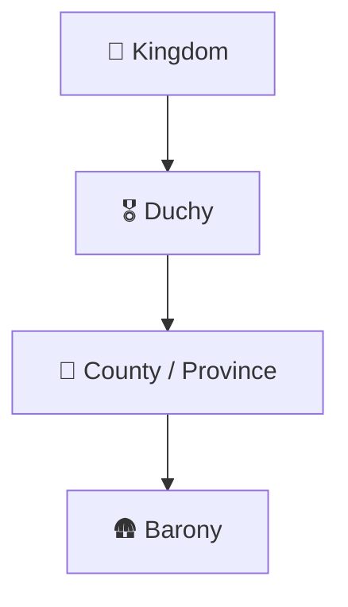
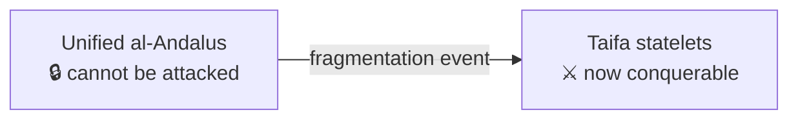

# 🗺️ The Map of Hispania

> 📌 *Game as of **29 June 2026** (beta) — details may change.*

The map is your realm made visible — the provinces you hold, the houses around you, and the lands you dream of conquering. It's also where you wage [[War]], manage your counties, and act through [[Diplomacy and Alliances|diplomacy]].

![[map-screen.png]]
*The map of Hispania — switch layers, select provinces, and plan your conquests.*

## How land is organised

Hispania is a feudal ladder of titles:

- **County (province)** — the basic playable piece of land. You hold counties directly.
- **Duchy** — a region grouping several counties.
- **Kingdom** — the top tier, grouping duchies.
- **Barony** — a small holding inside a county (secular or church-owned).

Your rank as a ruler comes from the highest title you hold — baron, count, duke, or king. See [[Climbing the Ladder]].

## The map's layers and tools

You can switch the map between views — **counties, duchies, kingdoms and baronies** — to see the world at different scales. The map is also where you select a province to attack, support, pressure, or build in. (Zoom and the layer filters live around the edges of the map screen.)

## Three realms in 722

When the game begins, Iberia is split between three worlds:

| Realm | Who | Where |
|---|---|---|
| ⛪ **Asturias** | Your Christian kingdom (House of Pelayo) | The northern mountains and northwest |
| 🛡️ **Navarra / the Basques** | Christian/Basque lords | The Pyrenees and upper Ebro |
| ☪️ **al-Andalus** | The Muslim Emirate (later Caliphate) | Most of the centre and south |

You begin small, in the north, with the vast Muslim south ahead of you. The whole arc of the game is the **Reconquista** — the long Christian push south (or, if you dare, a very different history).

## al-Andalus and the taifas

At the start, al-Andalus is a **single, unified power** — far too strong for a small northern crown to attack head-on. Historically it fragmented after a great crisis into many smaller **taifa** statelets. In the game, **you cannot make war on al-Andalus until it breaks apart** into taifas. Until then, focus on growing in the north and waiting for your moment.

## What you do on the map

- ⚔️ Declare and wage [[War]] for provinces, duchies or kingdoms.
- 🏗️ Build up your own counties — see [[Economy and Gold]].
- 🤝 Use [[Diplomacy and Alliances|diplomacy]] and [[Intrigue and Schemes|leverage]] against neighbours.
- ⛪ Spread your [[Faith and Religion|faith]] in lands you control.

---

*Next: [[Climbing the Ladder]] · Related: [[War]], [[The Geography of Hispania]].*
