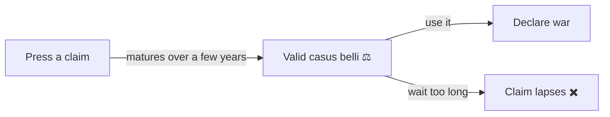
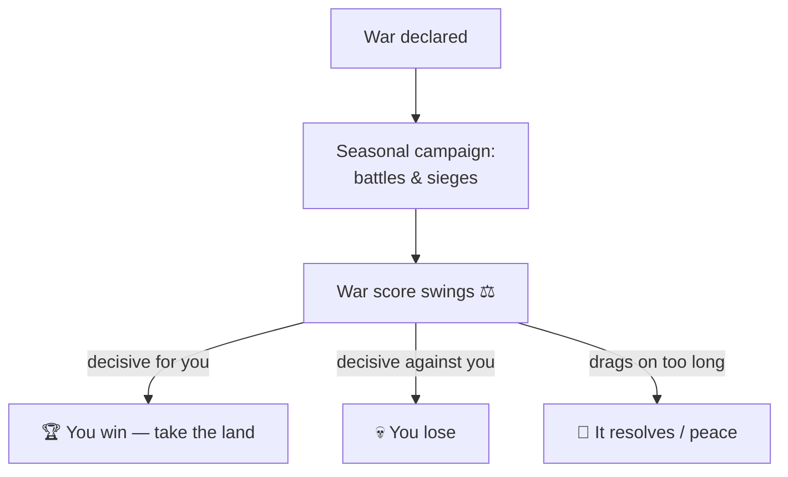

# ⚔️ War

> 📌 *Game as of **29 June 2026** (beta) — details may change.*

War is how realms grow and fall. It's powerful, but it isn't free — and you can't simply attack anyone, anytime.

![[war-screen.png]]
*The war screen — declare wars, set their scope, and follow the campaign.*

## You need a reason: the claim

You can't declare war out of thin air. First you need a **claim** — a legal pretext (a *casus belli*) on the land you want. You press a claim (through [[Diplomacy and Alliances|diplomacy]] or via your [[Your Council|chancellor]]), it takes a few **years to mature**, and then it's valid as a reason for war for a limited window before it lapses.

## Other conditions

Before you can declare, the game checks that:
- 💪 You have enough **Army** strength (more for bigger wars).
- 📏 The target is **within reach** of your borders — you can't strike across the whole peninsula from a single county.
- 🪜 The war makes sense by **rank** — a small count can't simply declare on a mighty king (with exceptions once al-Andalus fragments).
- 🤝 You're **not allied** with the target.
- 🔒 The target isn't **protected** (remember: unified al-Andalus can't be touched until the taifas form — see [[The Map of Hispania]]).

## War scope: how much is at stake

You choose the **scope** of a war, which decides what changes hands if you win:

| Scope | If you win, you take… |
|---|---|
| 🏰 **County war** | the single target province |
| 🎖️ **Duchy war** | the defender's provinces in that duchy (and the duchy title) |
| 👑 **Kingdom war** | the defender's lands across that kingdom (and the crown) |

Bigger scope means a bigger prize — and a tougher fight.

## How a war plays out

A war isn't one clash; it's a **campaign** fought over seasons, with battles, sieges and raids across the theatre. A hidden **war score** swings between the two sides as battles are won and lost. Reach a decisive lead and you win; let it swing far against you and you lose. Wars also have a maximum length before they resolve.

Your strength comes from your levies and professional troops — see [[Armies and Men-at-Arms]]. You can also try to **negotiate peace** during a war.

## Winning, losing and the cost

- 🏆 **Win** and you seize the contested lands and titles, and grow your realm.
- 💀 **Lose** and you may forfeit land, gold and prestige — and your monarch takes the stress of defeat.
- 💰 War is **expensive**: it costs upkeep and strains the [[Economy and Gold|treasury]] and the [[The Four Powers|People]].

## Civil war

The most dangerous war is the one *inside* your realm. If your **Army grows over-mighty**, or your nobles are pushed too far, a **civil war** can erupt: a powerful vassal rebels, part of your army defects, and you must fight to keep your throne. You can choose to **fight** or **negotiate** — but losing a civil war can cost you the crown itself.

> [!warning] Don't fight wars you can't pay for
> Every active war drains your treasury and tires your people. Win quickly, pick fights you can afford, and never let the Army become so powerful it turns on you.

## Tips

- 📜 **Make a claim first** — no claim, no war.
- 🎯 Match **scope** to your strength: take counties when small, kingdoms when mighty.
- 💰 Keep gold in reserve before you start.
- 🛡️ Watch your **Army** Power — too low can't fight, too high can rebel.

---

*Next: [[Armies and Men-at-Arms]] · Related: [[Diplomacy and Alliances]], [[The Map of Hispania]].*
