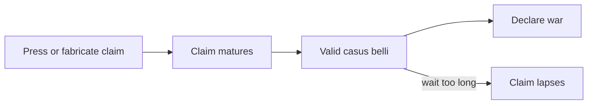
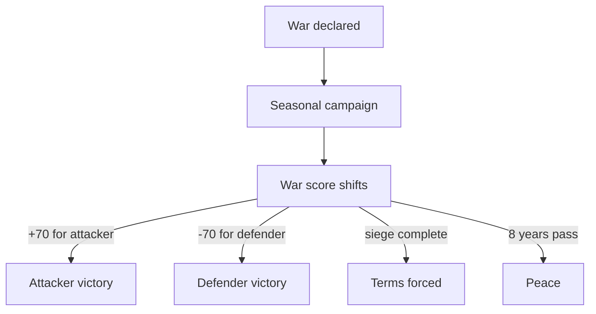

# War

> *Game as of **30 June 2026** (beta) - details may change.*

War is how titles and counties change hands. It is powerful, expensive and restricted by claims, rank, reach and alliances.

![[war-screen.png]]
*The war screen - choose scope, prepare claims, follow war score and manage the campaign.*

## You need a claim

You cannot declare most wars out of thin air. First you need a **claim**: a legal reason to fight for a county, duchy or kingdom. Claims can come from diplomacy, council work or events.

Claims are not permanent. Once ready, a war claim stays valid for a limited window, currently **12 years**, before it lapses.

## The declaration checklist

Before war is allowed, the game checks that:

- You have a landed playable title and enough **Army** standing.
- Bigger wars require more Army standing.
- The target is not your own province or title.
- Your house is not allied with the target house.
- You do not already have an active player war.
- The target title is not already tied up in another active war.
- The target is within campaign reach from your lands, vassal route or adjacent war theatre.
- The rank ladder makes sense: rulers normally fight equals or one tier below, with special exceptions for fragmented taifas.
- Unified al-Andalus is not protected from attack before taifa fragmentation.

## War scope

You choose the **scope** before declaring. Scope decides what is at stake:

| Scope | If you win |
|---|---|
| **County war** | You take the target province. |
| **Duchy war** | You take the defender's lands inside that duchy and contest the duchy title. |
| **Kingdom war** | You take the defender's lands across that kingdom and contest the crown/emirate. |

Bigger wars can transform the map, but they need stronger claims, reach, troops and finances.

## Campaigns and war score

Wars play out over seasons through battles, sieges, attrition and manoeuvre. The war score ranges from **-100** to **+100**. A side wins decisively at about **70** in its favour. A siege reaching full progress can also resolve the war, and a war that drags on too long can end in peace after roughly **8 years**.

## What determines strength

Your war strength comes from:

- Army Power and command standing.
- Levies, archers, riders and war funds.
- [[Armies and Men-at-Arms|Men-at-arms]] such as spearmen and heavy foot.
- Land, forts, buildings and development.
- Alliances that add military support.
- Rank: kings, dukes, counts and barons do not field the same weight from equal land.

Spearmen are especially useful against militarily powerful houses that field heavy cavalry.

## Civil war

The most dangerous war is internal. If your Army becomes too dominant, or noble pressure gets out of hand, a civil war can challenge your rule. You may fight or negotiate, but losing can cost your title or end the run if no heir and fallback holding survive.

> [!warning] Do not fight wars you cannot pay for
> Men-at-arms, war funds, attrition and debt all turn victories into long-term problems if your economy is weak.

## Tips

- Keep a claim maturing before you need it.
- Use county wars while small; save kingdom wars for strong realms.
- Secure alliances before declaring.
- Check reach and rank. If the button refuses war, the blocker is often not only the claim.
- Keep gold in reserve for upkeep and emergencies.

---

*Next: [[Armies and Men-at-Arms]] - Related: [[Diplomacy and Alliances]], [[The Map of Hispania]].*
