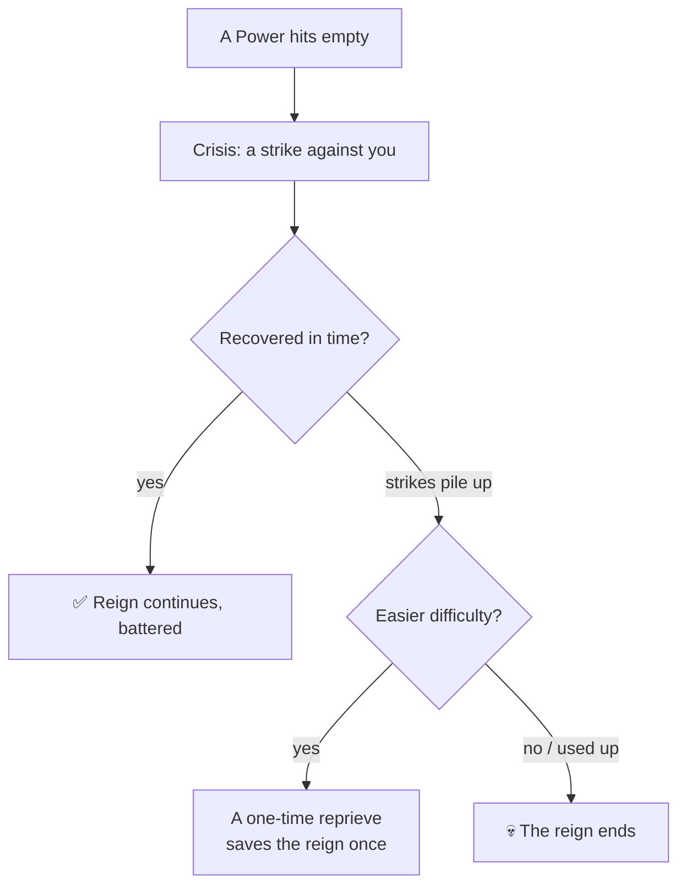

# 🔥 Crises and Disasters

> 📌 *Game as of **29 June 2026** (beta) — details may change.*

Sometimes the realm lurches toward catastrophe. A **crisis** happens when one of your [[The Four Powers|Powers]] reaches a breaking point — empty, or dangerously overflowing. How you weather it can decide whether your reign survives.

## A Power hits empty

If a Power falls to **nothing**, you're in a survival crisis. The game gives you a chance to recover — but **repeated, unresolved** crises wear down the reign until it ends.

On easier [[Difficulty|difficulties]], a struggling reign can get a **one-time reprieve** to pull back from the brink. On **Hard**, there's no safety net — a sustained collapse ends the reign.

## A Power overflows

The opposite extreme is just as deadly. If your **Church** or **Army** grows *too* powerful, that institution doesn't quietly help you — it **acts**:
- ⛪ An over-mighty **Church** must be forced to heel, bleeding your People and Treasury.
- ⚔️ An over-mighty **Army** can erupt into a **[[War|civil war]]** — your own soldiers turning on the crown.

You can usually rein in a dominating institution **once** per reign; let it climb back to crushing dominance and it will **depose** you.

## Plagues, famines and disasters

Beyond the Powers, the world throws **disaster events** at you — plague, famine, harsh weather. These can strike your population, your treasury and your family. Some are survived by careful choices; some can even claim your monarch's life (see [[Time and Your Lifespan]]).

> [!warning] Don't let two crises stack
> A single low Power is recoverable. Two at once — say an empty Treasury during a plague — can cascade. When one bar is in the red, stop expanding and **stabilise** before you do anything ambitious.

## Surviving crises

- 🩹 **Rescue the failing Power** immediately — favour cards and actions that lift it.
- ⚖️ **Never let Church or Army max out** — a dominating institution is as dangerous as a collapsing one.
- 💰 Keep a **reserve** (gold, goodwill) so a sudden disaster doesn't tip you over.
- 🛑 In a crisis, **pause your ambitions** and stabilise first.

---

*Related: [[The Four Powers]], [[War]], [[Difficulty]].*
