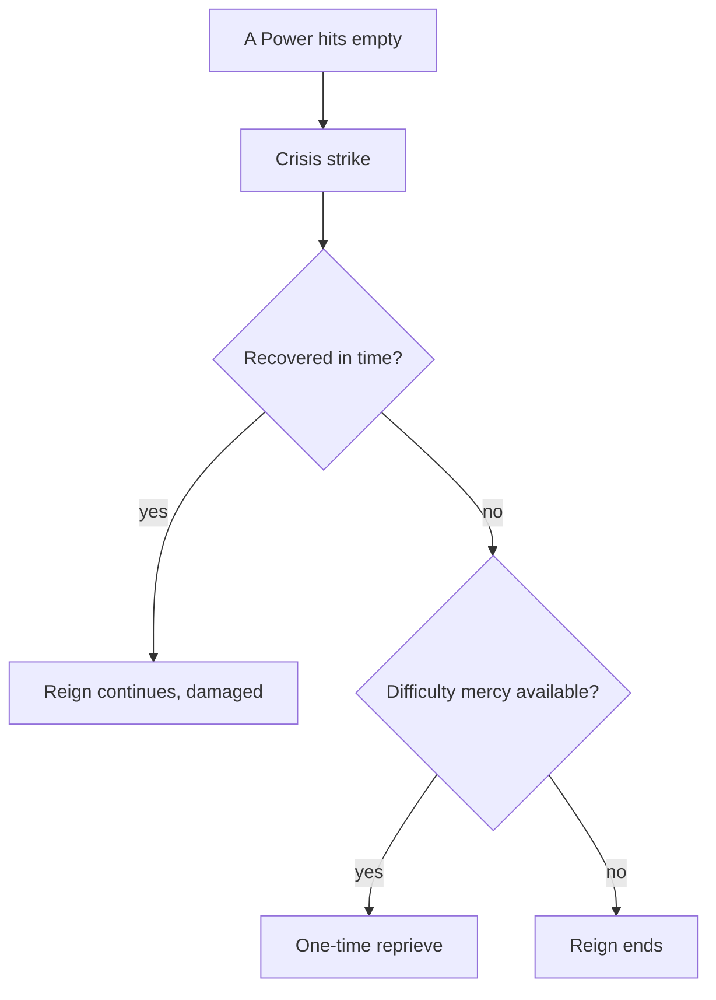

# Crises and Disasters

> Game as of **30 June 2026** (beta). Details may change.

Sometimes the realm lurches toward catastrophe. A **crisis** happens when one of your [[The Four Powers|Powers]] reaches a breaking point: empty, or dangerously overflowing.

## A Power hits empty

If a Power falls to nothing, you enter a survival crisis. The game gives you a chance to recover, but repeated unresolved crises can end the reign.

On easier [[Difficulty|difficulties]], a struggling reign can receive a one-time reprieve. On Hard, sustained collapse is usually final.

## A Power overflows

The opposite extreme is also dangerous. If **faith authority** or **Army** grows too powerful, that institution can act against the ruler.

- An over-mighty faith institution, whether Church, Umma or Aljama, must be forced back under control.
- An over-mighty Army can erupt into a [[War|civil war]].

You can usually rein in a dominating institution once per reign. Let it climb back to crushing dominance and it can depose you.

## Plagues, famines and disasters

Beyond the Power bars, the world can throw disaster events at you: plague, famine, harsh weather and family tragedy. These can strike population, Treasury and dynasty. Some are survived by careful choices; some can kill the ruler.

> [!warning] Do not let crises stack
> A single low Power is recoverable. Two at once, such as empty Treasury during a plague, can cascade. When one bar is in the red, stop expanding and stabilize.

## Surviving crises

- Rescue the failing Power immediately.
- Never let faith authority or Army max out.
- Keep a reserve of gold and goodwill.
- Pause ambition until the realm is stable again.

---

*Related: [[The Four Powers]], [[War]], [[Difficulty]].*
