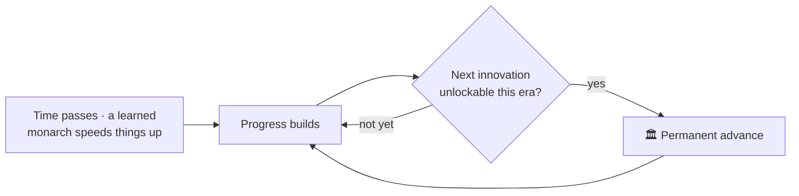

# 🏺 Culture and Innovations

> 📌 *Game as of **29 June 2026** (beta) — details may change.*

As the centuries roll by, your culture **advances** — unlocking permanent **innovations** that strengthen your realm. It's the game's sense of historical progress, from the early medieval world toward the dawn of the Renaissance.

## How it works

Your culture slowly gathers progress, and each era you can unlock the next age-appropriate **innovation** — a permanent advance like better cavalry, watermills, stone keeps, universities, or the printing press.

- 📚 A **learned, scholarly monarch** advances culture faster — another reason to raise well-educated heirs (see [[Traits and Your Character]]).
- 🕰️ Innovations are **gated by era**, so they unfold at a believable historical pace — you won't unlock late-medieval marvels in the 8th century.

## Three permanent-progress paths

Innovations sit alongside two other long-term investment tracks. Together they're how a long-lived dynasty becomes a powerhouse:

| Path | Fuelled by | Page |
|---|---|---|
| 🏺 **Innovations** | Cultural progress over time | This page |
| 📜 **Doctrines** | Church standing | [[Doctrines and Excommunication]] |
| 🏵️ **Legacies** | Dynasty renown | [[Dynasty Legacy]] |

## Tips

- 🎓 Raise **learned** rulers to speed cultural progress.
- 🕰️ Be patient — innovations arrive on history's schedule.
- 🏛️ Treat these permanent advances as the **long game** that outlasts any single reign.

---

*Next: [[Dynasty Legacy]] · Related: [[Doctrines and Excommunication]], [[Traits and Your Character]].*
