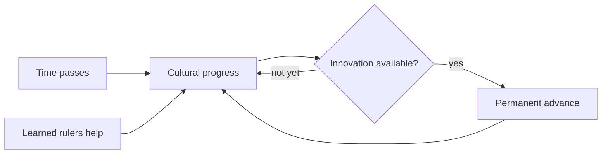

# Culture and Innovations

> Game as of **30 June 2026** (beta). Details may change.

As the centuries pass, your culture advances and unlocks permanent **innovations**. This is the game's long historical curve from the early medieval world toward the late medieval and Renaissance edge of 1492.

## How it works

Your culture slowly gathers progress. When the era is right, you can unlock advances such as better cavalry, mills, stone keeps, universities or printing.

- Learned and scholarly rulers help cultural progress.
- Innovations are gated by time, so late advances do not appear in the eighth century.
- Innovations outlast a single reign.

## Three permanent-progress paths

| Path | Fuelled by | Page |
|---|---|---|
| Innovations | Cultural progress over time | This page |
| Doctrines | Church, Umma or Aljama standing | [[Doctrines and Excommunication]] |
| Legacies | Dynasty renown | [[Dynasty Legacy]] |

Together, these are how a dynasty becomes stronger across centuries rather than only across one ruler's life.

## Tips

- Raise learned heirs if you want faster cultural progress.
- Do not expect every campaign to unlock every late innovation.
- Treat innovations, doctrines and legacies as the long game.

---

*Next: [[Dynasty Legacy]] - Related: [[Doctrines and Excommunication]], [[Traits and Your Character]].*
