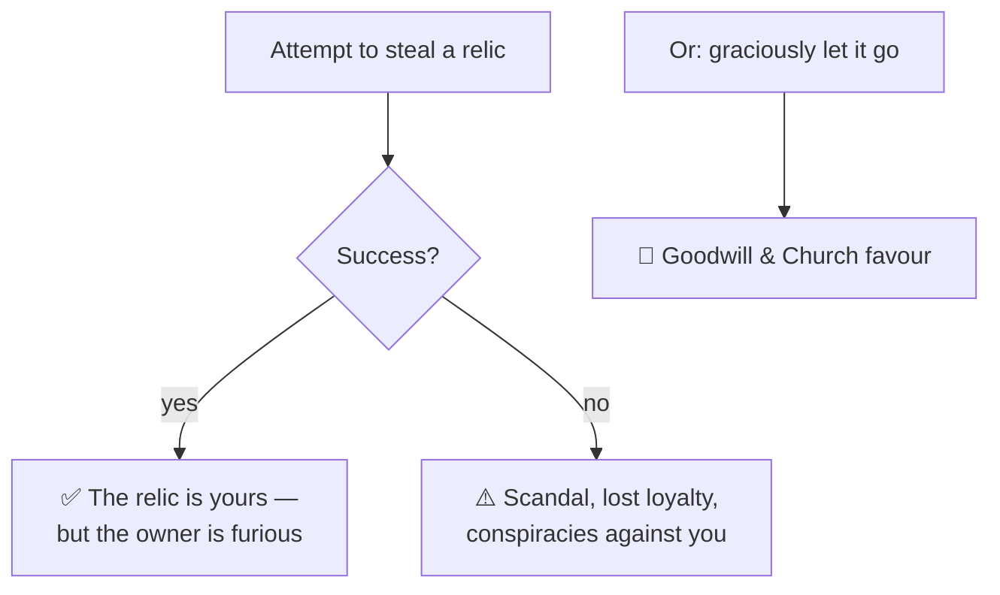

# 🗡️ Relics and Treasures

> 📌 *Game as of **29 June 2026** (beta) — details may change.*

Across your reigns you can gather **holy relics and historic treasures** — crosses, codices, holy banners and famed swords drawn from the legends of Christian Hispania. They're semi-historical marvels, not magic items, and above all a mark of **prestige**.

![[relics-screen.png]]
*Your collection of relics and treasures — the prestige history of your dynasty.*

## What relics are for

- 🏆 **Prestige & history** — relics record your dynasty's greatness and are displayed in your collection.
- ✨ **A one-time boon** — acquiring a relic often gives an immediate boost when it first comes into your hands.
- 📜 Their real power lies in the **moments and choices** that win them, not in passive bonuses ticking away forever.

## How you get them

Relics arrive through **events** — a pilgrimage, a battlefield discovery, a gift, a daring theft. Some event choices put a famous relic within your reach if you're bold (or pious) enough.

## Stealing a relic

The shadow path: you can try to **steal** a relic held by a courtier. It's a risky piece of [[Intrigue and Schemes|intrigue]]:

A successful theft enriches your collection but earns you an enemy; choosing to **let a relic go** instead buys goodwill and a little Church favour. Honour or ambition — your call.

## Tips

- ⛪ Relics shine brightest as **prestige** and dynastic legend — collect them with pride.
- 🗡️ Weigh a theft carefully: the fallout from failure can outweigh the prize.
- 🕊️ Sometimes the honourable choice (returning a relic) is the wiser one politically.

---

*Next: [[Crises and Disasters]] · Related: [[Intrigue and Schemes]], [[Dynasty Legacy]].*
