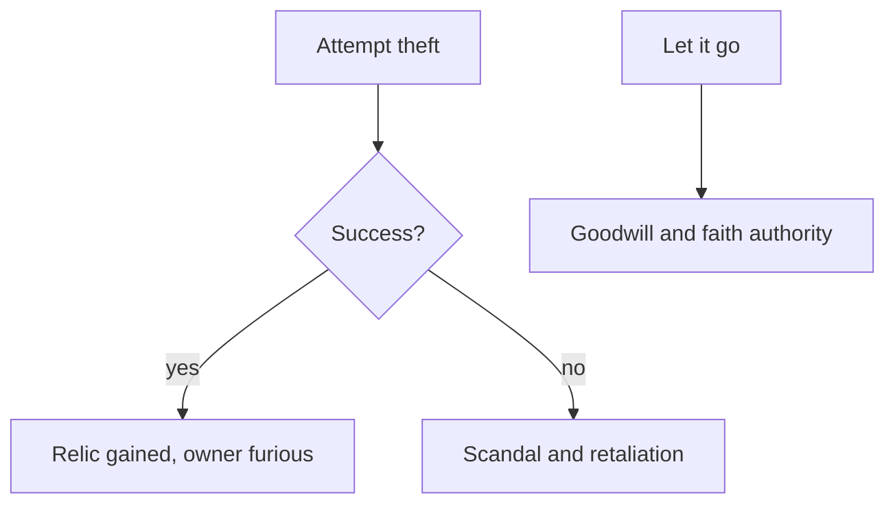

# Relics and Treasures

> Game as of **30 June 2026** (beta). Details may change.

Across your reigns you can gather holy relics and historic treasures: crosses, codices, banners and famed swords drawn from the legends of Hispania. They are semi-historical prestige pieces, not magic items.

![[relics-screen.png]]
*The relics screen shows the prestige history of your dynasty.*

## What relics are for

- **Prestige and history** - relics record your dynasty's greatness.
- **One-time moments** - acquiring a relic often brings an immediate event reward.
- **Story value** - their power is mainly in the decisions that win, steal, return or display them.

## How you get them

Relics arrive through events: pilgrimage, battlefield discovery, gifts, court disputes or daring theft. Some choices put a famous object within reach if you are bold, pious or ruthless enough.

## Stealing a relic

You can try to steal a relic held by another character. It is a risky [[Intrigue and Schemes|intrigue]] action.

A successful theft enriches your collection but creates an enemy. Returning or declining a relic may buy goodwill and religious standing.

## Faith note

Many relics are Christian-Hispanic in theme, because that is the tradition the current treasure deck draws from. Non-Christian rulers can still interact with the prestige and political side of the system.

## Tips

- Collect relics for prestige and dynastic legend.
- Weigh theft carefully. The fallout can be worse than the prize.
- Sometimes the honourable choice is the stronger political move.

---

*Next: [[Crises and Disasters]] - Related: [[Intrigue and Schemes]], [[Dynasty Legacy]].*
