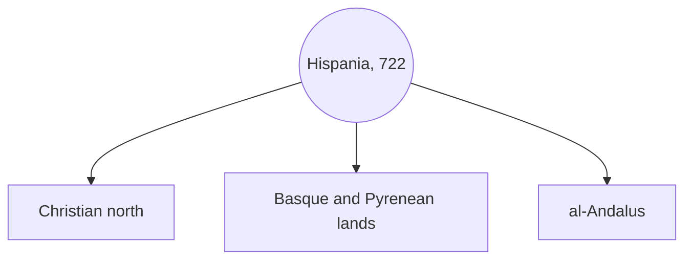

# The Geography of Hispania

> Game as of **30 June 2026** (beta). Details may change.

The game is set on the medieval Iberian Peninsula: **Hispania**. The old guide assumed a single Asturias campaign, but the current game lets you begin from many playable houses across the peninsula.

For the mechanical map, title hierarchy and victory rules, see [[The Map of Hispania]].

## The world in 722

The campaign begins in **722**, after the legendary stand at Covadonga. The peninsula is divided between the Christian north, the Pyrenean borderlands and Muslim al-Andalus.

### The Christian north

Asturias, Galicia, Leon, Castile and the Portuguese west form the rugged northern frontier: mountains, valleys, fortress towns and small realms trying to survive. Asturias remains the recommended first start, but it is no longer the only playable story.

### The Basque and Pyrenean lands

Navarra and the mountain lords sit between larger powers. These starts reward careful alliances, defensive terrain and timing.

### al-Andalus

The centre and south begin under Muslim power. In the early period, al-Andalus is protected as a unified force. It becomes more vulnerable when it fragments into taifas after **1031**. Later waves of power, including Almoravid and Almohad pressure, can reshape weak Muslim-held taifas.

## The long game

The historical arc still points toward the struggle for the peninsula, but the victory condition is broader than "take Granada". Your house wins the sandbox campaign by personally controlling every county on the map before the end of the era.

Granada remains a major milestone and a powerful historical symbol, especially near **1492**, but it is not the only thing the current victory check looks at. See [[Winning and Losing]].

## Semi-historical, not scripted history

The game begins from historical people, places and pressures, then lets your choices create alternate history. You might follow a recognisable Reconquista path, lead a Muslim house through the taifa age, keep a smaller realm alive for centuries, or build something the chronicles never saw.

---

*Related: [[The Map of Hispania]], [[Choosing Your Start]], [[Winning and Losing]].*
