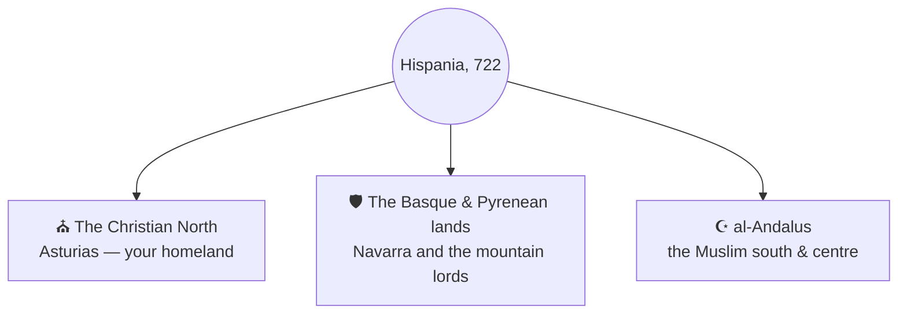

# 🌍 The Geography of Hispania

> 📌 *Game as of **29 June 2026** (beta) — details may change.*

The game is set on the medieval Iberian Peninsula — **Hispania** — across the long centuries of the **Reconquista**. Here's a player-friendly tour of the world you'll be fighting over. (For how land and titles work mechanically, see [[The Map of Hispania]].)

## The world in 722

You begin in the year **722**, just after the legendary stand at Covadonga, when a tiny Christian foothold survives in the northern mountains while most of Iberia lies under Muslim rule. The peninsula is split three ways:

### ⛪ The Christian North — your homeland
A rugged land of mountains, green valleys and fortress-towns — Galicia, Asturias, León, Castile and the Portuguese west. This is where the House of Pelayo begins, small but defiant. Your early game is about surviving and consolidating here.

### 🛡️ The Basque & Pyrenean lands
The mountain country of the Basques and the kingdom of Navarra — proud, independent lords in the high passes of the Pyrenees and the upper Ebro.

### ☪️ al-Andalus — the great south
The wealthy, sophisticated Muslim realm covering the centre and south — the marches of the Ebro and the east, and the rich southern districts around Córdoba, Seville and Granada. At the start it is **one unified power**, far too strong to attack directly. Only when it **fractures into taifa statelets** does the door to the south open. See [[The Map of Hispania]].

## The shape of the long game

The grand arc runs from the northern mountains to the far south:

The ultimate prize is **Granada**, the last Muslim stronghold, whose fall in **1492** closes the historical era — and crowns a victorious dynasty. See [[Winning and Losing]].

## A note on history

The game is **semi-historical** — it begins from real people and places (Pelayo, Gaudiosa, the early kingdoms) and a faithful map, but your choices quickly write an alternate history all your own. You might follow the real Reconquista… or forge something history never saw.

---

*Related: [[The Map of Hispania]], [[Winning and Losing]].*
